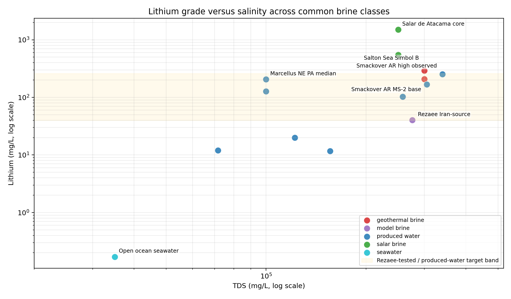
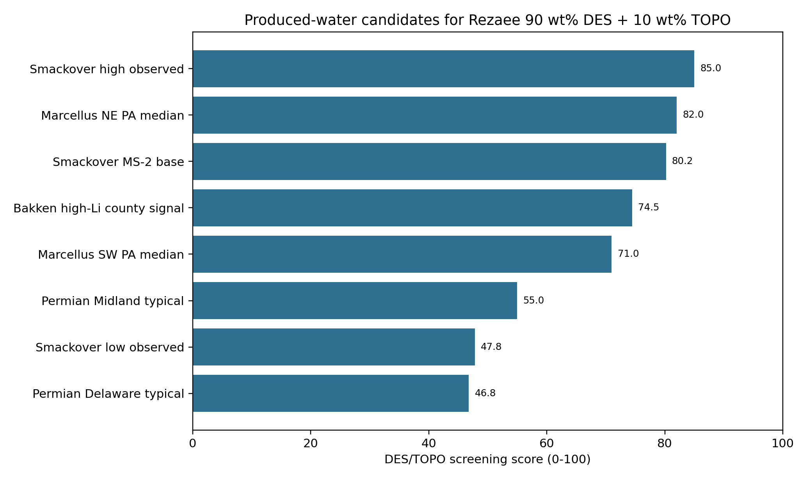
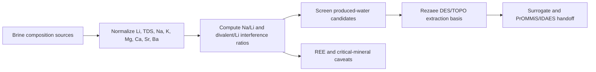

# Brine Composition Screening For Rezaee DES/TOPO Lithium Extraction

Date: 2026-05-08

## Executive Finding

Produced water is the most relevant brine family for the current case study because it combines high lithium in several basins with existing water-handling infrastructure and a severe sodium/divalent-ion background. For the Rezaee solvent system, the selected workflow assumes upstream pretreatment removes divalent cations first, so the extraction model starts from a clean Li+Na stream. The best near-term candidates are produced waters that have lithium in the same order of magnitude as the Rezaee model brine, high enough salinity to justify a thermodynamic model, and manageable divalent pretreatment risk.

The top produced-water candidates from this screening are:

- **Smackover AR high observed**: score `85.0/100`, Li `252.0 mg/L`, TDS `340000 mg/L`, class `primary candidate`.
- **Marcellus NE PA median**: score `82.0/100`, Li `205.0 mg/L`, TDS `100000 mg/L`, class `primary candidate`.
- **Smackover AR MS-2 base**: score `80.2/100`, Li `168.0 mg/L`, TDS `305000 mg/L`, class `primary candidate`.
- **Bakken high-Li county signal**: score `74.5/100`, Li `103.0 mg/L`, TDS `258193 mg/L`, class `secondary candidate`.
- **Marcellus SW PA median**: score `71.0/100`, Li `127.0 mg/L`, TDS `100000 mg/L`, class `secondary candidate`.

## Why Rezaee 90 wt% DES + 10 wt% TOPO Is The Screening Lens

Rezaee's optimized condition uses TBAC(1):decanoic-acid(2) hydrophobic DES with 10 wt% TOPO at 23 C and pH 10.4. The reported one-stage optimum is 48.57% lithium extraction with Li/Na selectivity of 4.41. Their multi-cation model brine contains Li, Na, K, Mg, and Ca, and the reported extraction efficiencies are 51.63% for Li, 9.97% for Na, 3.11% for K, 4.38% for Mg, and 2.29% for Ca.

That means the solvent is not a magic lithium-only separator. It is a Li-over-Na and Li-over-alkaline-earth candidate that still needs pretreatment and process modeling when Ca, Mg, Sr, or Ba are extreme.

## Composition Landscape

Produced waters occupy the practical middle of the chart: lower lithium than elite salars, but much higher lithium than seawater and often embedded in existing handling infrastructure. Smackover and Marcellus are the most relevant produced-water clusters for this DES/TOPO case because they sit near or above 100 mg/L Li. Bakken can reach attractive Li in some high-Li counties but is extremely saline and sodium-rich. Permian produced water is important for volume and operations, but the public screening ranges are lower in Li.

## Produced-Water Candidate Ranking

| Rank | Candidate | Li mg/L | TDS mg/L | Na/Li | Divalent/Li | Score | Interpretation |
|---:|---|---:|---:|---:|---:|---:|---|
| 1 | Smackover AR high observed | 252.0 | 340000 | 281.0 | 180.7 | 85.0 | primary candidate |
| 2 | Marcellus NE PA median | 205.0 | 100000 |  | 4.9 | 82.0 | primary candidate |
| 3 | Smackover AR MS-2 base | 168.0 | 305000 | 381.5 | 250.9 | 80.2 | primary candidate |
| 4 | Bakken high-Li county signal | 103.0 | 258193 | 771.0 | 15.8 | 74.5 | secondary candidate |
| 5 | Marcellus SW PA median | 127.0 | 100000 |  | 18.1 | 71.0 | secondary candidate |
| 6 | Permian Midland typical | 20.0 | 122000 |  | 0.0 | 55.0 | screening only |
| 7 | Smackover AR low observed | 11.7 | 156000 | 3170.9 | 1458.5 | 47.8 | screening only |
| 8 | Permian Delaware typical | 12.0 | 71600 |  | 0.0 | 46.8 | screening only |

## Engineering Interpretation

1. **Smackover is the best produced-water presentation basis.** It has high lithium, high TDS, bromine/brine infrastructure context, and source-backed major-ion rows. The main issue is Ca/Sr pretreatment, not lithium grade.
2. **Marcellus NE is chemically attractive.** It has high lithium and comparatively low Mg/Li among Marcellus regions. Missing sodium/calcium detail in the screening table should be filled before process simulation.
3. **Marcellus SW is operationally attractive but chemically harder.** It has lower lithium and higher Mg/Li than NE PA, but higher produced-water volumes per well in the cited study.
4. **Bakken is a high-salinity stress test.** It has high Na, Sr, K, Rb, and TDS; it is useful for critical-mineral recovery framing, but likely needs stronger pretreatment before DES extraction.
5. **Permian is a process-volume candidate, not the best Li-grade candidate.** It should remain in the comparison set because produced-water volumes are large, but Li grades are lower.

## Critical Minerals And REE Caveat

Lithium is a critical mineral, but it is not a rare earth element. Produced-water literature often discusses Li and REE together because both can occur in unconventional aqueous resources. For this case study, REE should be treated as a screening and future-data issue unless a specific brine source reports REE concentrations. The current clean Smackover source table reports several trace metals with censoring, but REE are not reported.

## Study Workflow

## Recommended Next Data Pulls

- Add sodium, calcium, strontium, and barium distributions for Marcellus NE/SW from the underlying data release.
- Pull basin-scale rows from the USGS Produced Waters Database for Smackover, Marcellus, Bakken, and Permian using the same censoring and charge-balance rules.
- Add REE only where the source reports measured REE values; do not infer REE from generic critical-mineral language.
- For the DES/TOPO model, prioritize candidates with Li above 100 mg/L, Na/Li within the Rezaee-tested or Rezaee-real-brine extrapolation envelope, and divalent pretreatment that can be explicitly costed.

## Source Log

| Source | Status | Use |
|---|---|---|
| [USGS_PWDB_v23](https://data.usgs.gov/datacatalog/data/USGS%3A59d25d63e4b05fe04cc235f9) | public database | Produced-water context, trace-element coverage, and database scope. |
| [USGS_Smackover_2024](https://www.usgs.gov/publications/lithium-resource-smackover-formation-brines-southern-arkansas) | USGS report | Smackover resource context and southern Arkansas produced-water source rationale. |
| [Local_Smackover_clean_rows](internal curated data product) | local cleaned source table derived from USGS southern Arkansas brines | Low, base, and high Smackover composition cases. |
| [Mackey_2024_Marcellus](https://www.nature.com/articles/s41598-024-58887-x) | peer-reviewed article | Marcellus Li, Mg, TDS, Mg/Li, and regional produced-water variability. |
| [Jakaria_2025_Bakken](https://link.springer.com/article/10.1007/s13202-025-02012-9) | peer-reviewed article | Bakken TDS, Na, Sr, K, Rb, critical-element context, and high-Li county signals. |
| [Permian_valorization_2026](https://www.mdpi.com/2073-4441/18/6/739) | peer-reviewed article | Delaware and Midland Basin Li ranges and median TDS context from public abstract/snippet. |
| [Miranda_2022_PW_review](https://www.mdpi.com/2073-4441/14/6/880) | peer-reviewed review | Broad produced-water ranges for Na, Ca, Mg, K, Ba, Sr, Li, and REE/critical-mineral framing. |
| [Salton_Nature_2025](https://www.nature.com/articles/s41467-025-56071-x) | peer-reviewed article | Salton Sea synthetic geothermal brine compositions in mM, converted to mg/L. |
| [USGS_Lithium_brines_2015](https://www.usgs.gov/publications/lithium-brines-a-global-perspective) | USGS report | Global brine-class framework and salar deposit controls. |
| [Rezaee_2025_RSM](https://doi.org/10.1021/acs.iecr.4c03496) | peer-reviewed article in local library | 90 wt pct TBAC(1):DA(2) DES plus 10 wt pct TOPO optimum, extraction, selectivity, and model-brine composition. |
| [Rezaee_2026_SI](https://doi.org/10.1016/j.fluid.2026.114737) | supporting information in local library | DES/TOPO/RLi/RNa thermodynamic-supporting inputs and density evidence. |
