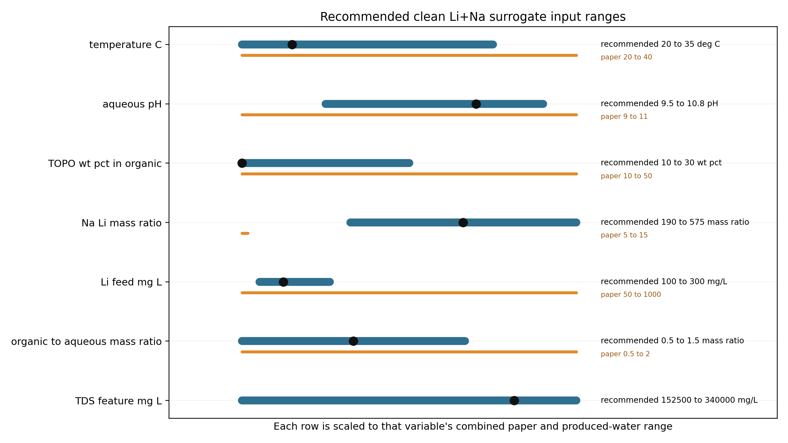

# Rezaee Clean Li/Na Surrogate Input Space

Date: 2026-05-08

## Basis

The selected produced-water site is treated as a source-backed Smackover feed followed by an upstream pretreatment block. The extraction model starts after divalent removal, with lithium and sodium as the active aqueous cations. Calcium, magnesium, strontium, and barium remain pretreatment-cost and validation-guardrail variables, not active extraction species.

Nominal clean-stream basis: Li `168.0 mg/L`, Na `64100.0 mg/L`, Na/Li mass ratio `381.5`, source TDS feature `305000 mg/L`.

## High-Priority Variables

| Variable | Recommended range | Nominal | Priority | Why it matters |
|---|---:|---:|---|---|
| temperature_C | 20.0 to 35.0 deg C | 23.0 | high | Temperature was the strongest reported selectivity factor; lower temperature favored selectivity. |
| aqueous_pH | 9.5 to 10.8 pH | 10.4 | very_high | pH was the strongest reported lithium-extraction factor; pH above 11 caused third phase/emulsion risk. |
| TOPO_wt_pct_in_organic | 10.0 to 30.0 wt pct | 10.0 | high | TOPO has a weak but nonzero response effect; 10 wt pct was selected to reduce TOPO cost while retaining Li extraction. |
| Na_Li_mass_ratio | 190.0 to 575.0 mass ratio | 381.54761904761904 | very_high | Rezaee reported weak Li-extraction response in the paper domain; produced water forces a high-Na extrapolation that must be mapped explicitly. |
| Li_feed_mg_L | 100.0 to 300.0 mg/L | 168.0 | high | Extraction percentage was stable across 50-1000 ppm in Rezaee; produced-water candidate ranking is strongly tied to Li grade. |
| organic_to_aqueous_mass_ratio | 0.5 to 1.5 mass ratio | 1.0 | very_high | Higher aqueous-to-organic ratio decreased extraction; O/A controls stage capacity and distribution-coefficient interpretation. |

## Figure

## Seed Run Matrix

The generated seed matrix contains `19` rows. It is not the final surrogate dataset. It is the input contract for the pending concrete script that will run the ePC-SAFT/Rezaee bridge over these variables and return distribution coefficients, extraction percentages, validity flags, and PrOMMiS/IDAES transfer variables.

## Waiting Point

The next phase should not fabricate surrogate response data. Until the concrete run script exists, the honest completion state is: feed basis, variable bounds, seed points, and downstream handoff schema are ready; response surfaces and optimizer-ready surrogate coefficients are pending the actual model-run generator.
