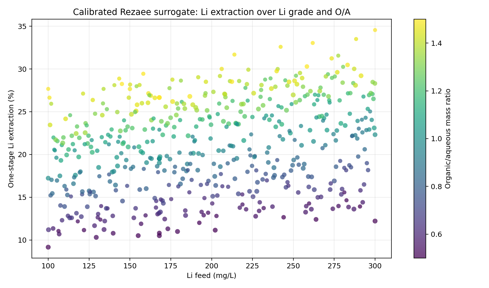
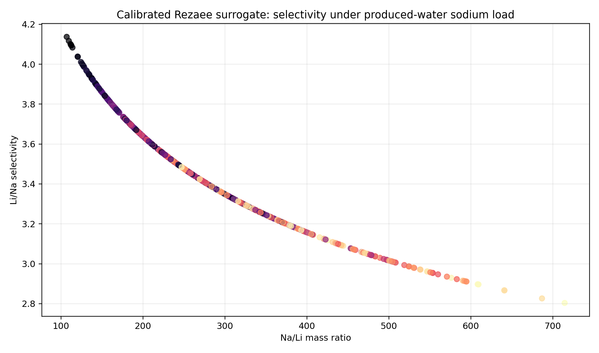
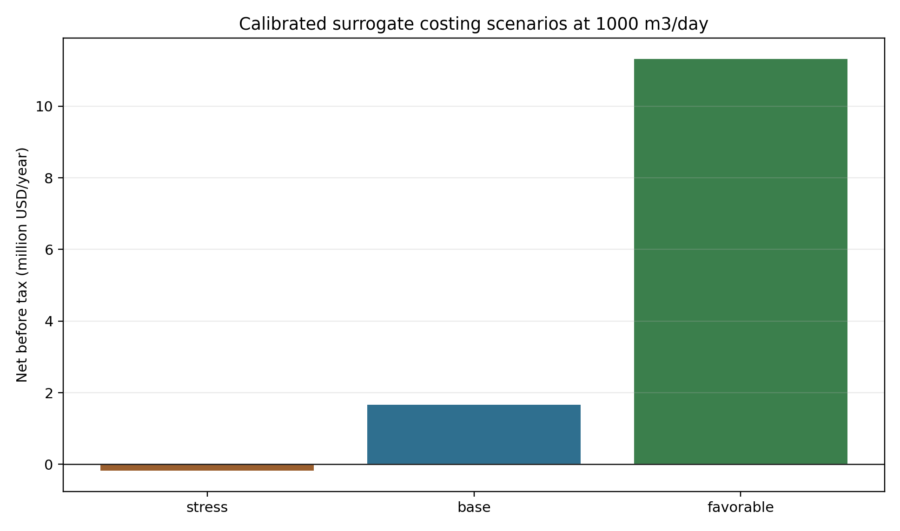

# Rezaee TDS-Li-OA Calibrated Distribution Surrogate

Date: 2026-05-15

## Purpose

This dataset is a deterministic surrogate-run matrix for exercising the Lithium_Extraction to PrOMMiS/IDAES workflow with source-backed Rezaee Li/Na extraction targets. It consumes the repaired ePC-SAFT package validation bundle, fits a lightweight log-distribution response surface, and records the package commit used for the pre-surrogate gate.

## Scope

- Rows: `523`
- Random seed: `20260508`
- Model basis label: `source_backed_rezaee_target_distribution_surrogate`
- Source schema: `source_backed_2025_target_summary`
- Source-backed target rows: `32`
- Surrogate training rows: `31` from `C:\Users\Tanner\Documents\git\Lithium_Extraction\analyses\rezaee_2026_pcsaft_epcsaft\data\processed\rezaee_2025_extraction_target_summary.csv`
- Training log D Li fit: `R2=0.7797`, `RMSE=0.1101`.
- Training log D Na fit: `R2=0.6134`, `RMSE=0.1436`.
- ePC-SAFT commit: `b4144c72e580eaa2d2b7ebf19c2040063f1eddd7`
- Phase-tagged reactive rows evaluated by package gate: `26`
- UQ variables: TDS feature, Li feed concentration, organic/aqueous mass ratio.
- Fixed chemistry variables: T = 23 C, pH = 10.4, TOPO = 10 wt%, residual divalent = 0 mg/L except guardrail rows.

## Costing Readiness Scenarios

| Scenario | Li recovery used (%) | Li2CO3 t/year | Net before tax (million USD/year) |
|---|---:|---:|---:|
| stress | 25.04 | 44.43 | -0.18 |
| base | 47.85 | 142.65 | 1.66 |
| favorable | 71.97 | 383.13 | 11.33 |

## Validation Summary

- Status: `passed`
- Finite outputs: `True`
- Nominal MS-2 row count: `1`
- Li extraction range: `9.16-34.55%`
- Na extraction range: `3.47-11.32%`
- Phase-ratio-corrected D_Li range: `0.2016-0.352`
- Phase-ratio-corrected D_Na range: `0.07192-0.08508`

## Figures

## Boundary

This is a source-backed Rezaee target surrogate for process screening. The repaired package supplies the phase-tagged reactive route and activity/fugacity evaluation path; the high-sodium produced-water rows remain extrapolations beyond the original Rezaee Na/Li target range.
