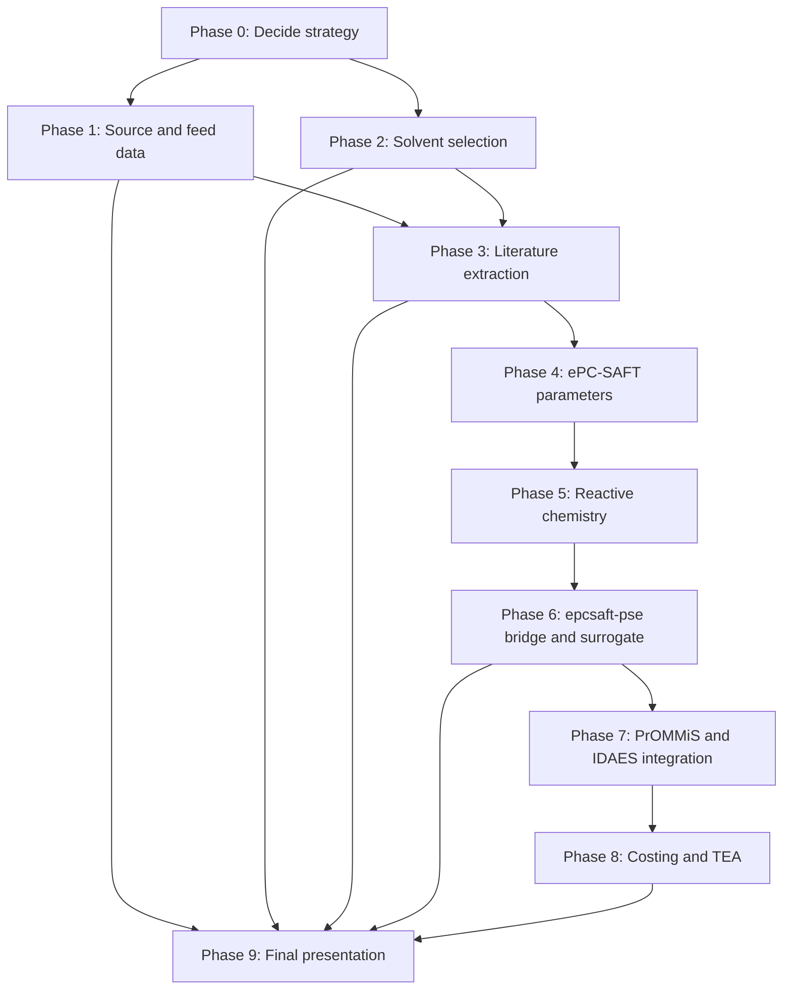

> Historical prompt, superseded 2026-05-08: this planning prompt is preserved for provenance and contains older HBTA/Gando-first assumptions. The current accepted Phase 0-9 basis is the Rezaee DES/TOPO Li/Na bridge after divalent pretreatment. Use `docs/phase0_8_completion_report.md`, `docs/phase9_final_presentation_skeleton.md`, and `docs/plans/lithium_project_status_handoff_2026_05_08.md` for current agent work.

Here is the goal to complete and ask questions with until a full plan is found and developled that is comphrehensive and is updated and adapted based on answers and results:

As we talk you can update the md document with updates.

I think the most important thing is to be realistic where it matters but cut corners where is necessary and allowed. The most important thing is the produced water location and composition. What is less important is the exact solvent that one would use to extract the lithium in my last case study, all I showcased was lithium separating from sodium with the assumption that it was already preprocessed to remove all the divalent cations and anions. Be sure to find that powerpoint and that analysis on that and the why and read up on it. Getting the true or pretty much true composition of what the lithium concentration would be is key here and also is showing a range and simulation the range of TDS for the produced water to showcase the cost differences in that range and to try to show what is worth and what is not based on that other other factors or input variables (water amount, flow etc). My preference is to start with what was already done in the existing scripts and the presentaion here with slides 16 to 18 `"C:\Users\Tanner\Documents\git\Lithium_Extraction\docs\Slides\Lithium Extraction with ePC-SAFT.pptx"` if you need to make a version of the slides that are easier to read go ahead and make a copy of it and convert it to a mroe readbale format but dont change the contents of this one.

So all in all produced water site and composition to get a realistic and real range of lithium, then showcase true solvent extraction of lithium from sodioum with lithium going into an organic stream and showcase that with a range of TDS. If we can fit new parameters to a solvent that works or find some epcsaft parameters for existing sovlents that would also be great. I kknow in the presentation and associated script there was some chemistry invovled but it might have been assumed to make it possible to show but i think the best chemistry is with the Gando example with the reaction that should be present in the paper using [@zotero-local-research](plugin://zotero-local-research@zotero) for Gando 2025 we should be able to get some real reaction constant of sort to do actual chemcil reaction math for that. Honestly the easy part is the bridge and on

Ask a``ll the questions you want while you also use subagents to dive into zotero and look for relavant articles or even online for releavant articles that are related or that may help and to reduce token and credit use with using efficient agent for remidial tasks

---

# Planning Update - 2026-05-07

This section records the current working plan so the produced-water lithium case study can continue without losing the reasoning trail. It preserves the original intent above: be scientifically realistic where it matters, make acceptable shortcuts where needed, and keep the case study focused on why ePC-SAFT should be implemented into the PrOMMiS and IDAES ecosystem.

## Current Goal

Build a presentation-ready and implementation-ready produced-water lithium extraction case study that shows:

1. A real or near-real produced-water source, preferably southern Arkansas Smackover unless a better U.S. source is found.
2. A source-specific brine composition with Li, Na, major ions, TDS, and any reported critical minerals or REE.
3. True lithium transfer from aqueous brine into an organic solvent phase, with Li separated from Na over a realistic TDS range.
4. Explicit treatment of pretreatment, especially Ca and Mg removal or suppression.
5. ePC-SAFT as the thermodynamic engine that computes equilibrium, phase split, chemical speciation, distribution ratios, selectivity, and validity diagnostics.
6. A surrogate or bridge that passes ePC-SAFT-derived transfer variables into PrOMMiS/IDAES staged solvent extraction models.
7. PrOMMiS/IDAES as the process layer for MSContactor/unit-model solves, flowsheet analysis, optimization, and costing.
8. A final deck narrative that makes clear what is source-backed, what is model-backed, what is calibrated, and what is still an explicit parameter gap.

## Hard Boundaries

1. Ionic liquids are excluded from the active benchmark.
   - They can be background only.
   - They should not be used as the main case study because of cost and uncertainty.
2. The active solvent case should use conventional non-ionic ligand chemistry.
3. The current true reactive HBTA/TOPO ePC-SAFT model is not scientifically complete yet.
   - Missing pieces include HBTA parameters, TOPO parameters if not already defensibly available, sulfonated kerosene or diluent surrogate parameters, lithium-ligand complex parameters, and defensible Li/Na reaction-equilibrium constants. Divalent complex parameters are out of scope for the active Li/Na-after-pretreatment objective.
   - Until those are found or fitted, the current Gando/Shan workflow must be labeled as a structured or calibrated fallback.
4. Do not claim the Gando/Shan extraction paper is a Smackover composition source unless a matching Smackover feed source is found.
   - Smackover can be the siting and source-composition case.
   - Shan/Gando 2025 can be the non-ionic extraction-chemistry case.
5. If REE are not reported for the chosen feed, record `not_reported`.
   - Do not infer REE from a nearby basin, review paper, or generic produced-water claim.

## Local Evidence Found So Far

### Prior PowerPoint Slides 16-18

The old PowerPoint file is:

`docs/Slides/Lithium Extraction with ePC-SAFT.pptx`

Direct PPTX XML text extraction from slides 16-18 only exposes the repeated slide title:

`Case Study: 2nd stage extraction of Li+ from Na+`

That means the important body content is likely embedded as graphics or non-text objects, so the old deck should be treated as a visual artifact unless a readable copy is rendered. The repo notes and generated artifacts show the old case was a Stage-2 Li/Na solvent-extraction showcase with Li moving to an organic stream after assumed pretreatment.

### Old Jang/TBP+D2EHPA Baseline

The old strongest local Li/Na comparison artifact is:

`data/multiphase/jang_2017_stage2_li_na_summary.md`

Current interpretation:

1. It is useful as a limitation or baseline case.
2. It should not be the flagship proof of selective lithium extraction.
3. It used TBP + D2EHPA style chemistry with placeholder or fallback assumptions.
4. It showed only weak Li/Na separation in the local artifact:
   - about 40 percent cumulative Li extraction after 10 contacts;
   - about 38 percent cumulative Na extraction after 10 contacts;
   - selectivity only slightly above 1.

Deck message:

> The older placeholder showed that a black-box or fixed-partition solvent extraction case does not convincingly prove lithium selectivity. The new case needs ePC-SAFT thermodynamics and chemistry-aware transfer variables.

### Current Gando/Shan HBTA/TOPO Showcase

The current leading non-ionic extraction basis is Shan/Gando 2025:

`Shan, Q.; Zhu, G.; Fan, P.; Liang, M.; Zhang, X.; Liu, J.; Wu, G. 2025. Influence Mechanism of Coexisting Ions on the Extraction Efficiency of Lithium from Oil and Gas Field Water. Water 17, 2258. DOI: 10.3390/w17152258. Zotero key: JUNBXVTI.`

Local evidence files:

1. `data/reference/produced_water/non_ionic_case_study_sources.md`
2. `data/reference/produced_water/non_ionic_case_study_process_summary.csv`
3. `data/reference/produced_water/non_ionic_case_study_transfer_matrix.md`
4. `data/reference/produced_water/non_ionic_case_study_transfer_matrix.csv`
5. `data/multiphase/gando_2025_one_stage_assets/`
6. `data/multiphase/gando_2025_stage3_comparison.md`

Current repo-backed Gando/Shan results:

1. Nominal one-stage selective showcase:
   - Li extraction: about 52.0047 percent.
   - Na extraction: about 0.9067 percent.
   - Li/Na selectivity: about 118.
2. Three-stage crossflow showcase:
   - cumulative Li extraction after stage 1: about 52.0047 percent.
   - cumulative Li extraction after stage 2: about 84.8499 percent.
   - cumulative Li extraction after stage 3: about 97.8025 percent.
   - cumulative Na extraction after stage 3: about 3.5827 percent.
3. Shan/Gando field-water process anchor:
   - actual oil and gas field water case exists;
   - HBTA/TOPO/sulfonated kerosene system;
   - three-stage field-water extraction after impurity removal is about 97 percent Li;
   - Li2CO3 purity is about 99 percent;
   - Ca and Mg are major inhibition/pretreatment concerns.

Current limitation:

The Gando/Shan workflow is the best presentation story, but the ePC-SAFT chemistry is still not fully predictive until the HBTA/TOPO parameter and reaction-equilibrium gaps close.

## Dependency Map

## Phase 0 - Decide The Case-Study Strategy

Status: partly complete, still needs user approval.

Depends on:

None. This is the root decision phase.

Decisions to make:

1. Flagship source:
   - default: southern Arkansas Smackover;
   - alternative: any produced-water source where composition and extraction evidence are tied to the same paper/sample.
2. Flagship solvent:
   - default: HBTA/TOPO/sulfonated kerosene from Shan/Gando 2025;
   - backup: DBM/TOPO if the original actual-brine paper can be recovered;
   - comparison only: TBP+D2EHPA/Jang.
3. Presentation standard:
   - high realism: real source composition, literature extraction, explicit parameter gaps;
   - faster showcase: existing Gando wrapper and staged artifacts, with a visible calibrated-fallback label.
4. Uncertainty style:
   - pitch-heavy: emphasize the implementation value and roadmap;
   - technical-heavy: emphasize what is solved, fitted, assumed, and missing.

Output needed:

1. One flagship source.
2. One flagship solvent.
3. One backup solvent.
4. One accepted uncertainty level for the presentation.

Recommended current decision:

Use Smackover as the flagship site and HBTA/TOPO as the flagship chemistry, while clearly saying the current model is Smackover-like rather than Smackover-calibrated until a source-cited Arkansas feed table is complete.

## Phase 1 - Source And Feed Data

Status: partially complete, still one of the highest priority gaps.

Depends on:

Phase 0 source decision.

Tasks:

1. Build or finalize a source-specific feed table.
2. Include major cations:
   - Li;
   - Na;
   - K;
   - Mg;
   - Ca;
   - Sr;
   - Ba.
3. Include major anions and bulk properties:
   - Cl;
   - Br if reported;
   - SO4 if reported;
   - HCO3 or alkalinity if reported;
   - TDS;
   - pH;
   - density if reported;
   - temperature and pressure if relevant.
4. Include critical minerals and REE only when reported:
   - Mn;
   - Fe;
   - Zn;
   - Cu;
   - Ni;
   - Al;
   - B;
   - REE.
5. Record source metadata:
   - formation;
   - basin;
   - well or field if available;
   - sample date if available;
   - DOI or report URL;
   - units;
   - pretreatment/sampling notes.
6. Build a TDS/Li range for sensitivity:
   - low-Li / low-TDS case;
   - base case;
   - high-Li / high-TDS case.

User-owned or user-led tasks:

1. Approve Smackover as the flagship site or name a different site.
2. Provide any proprietary well/brine data if it should be used.
3. Decide whether REE are central to the pitch or only a secondary opportunity.
4. Approve whether the model can use a literature Smackover composition rather than an operator-specific sample.
5. Provide or approve a flowrate basis for economics.

Output needed:

1. `data/reference/produced_water/non_ionic_case_study_composition.csv`
2. A source log for every number.
3. A table that separates:
   - Smackover/source-composition evidence;
   - Shan/Gando extraction-chemistry evidence;
   - model-generated outputs.

## Phase 2 - Solvent-System Selection

Status: mostly decided, but backup-source search remains.

Depends on:

Phase 0 strategy and Phase 1 feed reality.

Current ranking:

| Rank | System | Evidence realism | ePC-SAFT feasibility | Showcase ease | Current recommendation |
|---:|---|---|---|---|---|
| 1 | HBTA/TOPO/sulfonated kerosene | High: actual oil and gas field water process, coexisting-ion experiments, multistage extraction | Medium: missing direct HBTA/TOPO/reactive-complex parameter set | High: existing one-stage, salt sweep, O/A sweep, and three-stage assets | Flagship |
| 2 | DBM/TOPO | Medium: conventional ligand family and review-supported actual-brine claims | Low to medium: original paper and parameters still needed | Low now: no local staged workflow yet | Backup if source is recovered |
| 3 | TBP+D2EHPA/Jang | Medium for produced-water context | Medium for quick demo, low for faithful chemistry | Medium: local script exists | Limitation/comparison |
| 4 | TOP/TBP + FeCl3 class | Medium-low in current repo notes | Low: no local workflow and likely acid/corrosion/Fe-loss issues | Low now | Optional alternate search |
| 5 | Ionic liquids | Some literature exists | Out of active scope | Out of active scope | Excluded |

Tasks:

1. Keep HBTA/TOPO as the flagship unless a fatal blocker appears.
2. Search Zotero and online sources for the original DBM/TOPO actual-brine paper.
3. Keep TBP+D2EHPA/Jang as the "old placeholder baseline" slide.
4. Keep TOP/FeCl3 as a possible literature inset, not the main implementation case.
5. Do not spend implementation time on ionic-liquid systems.

Output needed:

1. A final solvent-selection decision table.
2. A one-paragraph reason for excluding ionic liquids.
3. A one-paragraph reason why exact solvent identity matters less than proving the ePC-SAFT-to-PrOMMiS transfer-variable workflow.

## Phase 3 - Literature Extraction

Status: partially complete for Shan/Gando; not complete for DBM/TOPO backup.

Depends on:

Phase 2 selected solvent.

Tasks for HBTA/TOPO:

1. Extract simulated feed composition from Shan/Gando.
2. Extract actual field-water process conditions.
3. Extract HBTA concentration.
4. Extract TOPO concentration.
5. Extract diluent identity.
6. Extract saponification degree.
7. Extract O/A ratio.
8. Extract contact time.
9. Extract Na, K, Ca, Mg, and organic-matter effect data.
10. Extract three-stage extraction data.
11. Extract back-extraction and Li2CO3 precipitation data.
12. Check whether any reaction constants are directly reported.
13. Record missing constants as missing rather than inferring them silently.

Tasks for backup systems:

1. Locate original DBM/TOPO actual-brine paper cited by review literature.
2. Extract its feed, solvent, O/A, stage, and selectivity data.
3. Keep Jang/TBP+D2EHPA data as comparison only.
4. Extract TOP/FeCl3 practical limitations if it is discussed in the final deck.

Output needed:

1. Literature extraction CSV tables.
2. Figure-digitized data if tables are missing.
3. A claim/source map for every deck number.
4. A `not_found` table for reaction constants and missing feed fields.

## Phase 4 - ePC-SAFT Parameter Work

Status: not complete; this is the main scientific/modeling blocker.

Depends on:

Phase 3 literature extraction.

Tasks:

1. Build the full species inventory.
2. Find existing ePC-SAFT/PC-SAFT parameters for:
   - water;
   - Li+, Na+, K+, Mg2+, Ca2+, Sr2+, Ba2+, Cl-, Br-, SO4 when possible;
   - TOPO or TOP;
   - HBTA or defensible beta-diketone surrogate;
   - sulfonated kerosene or diluent surrogate;
   - Li-ligand complex;
   - Mg/Ca competing complexes if modeled.
3. Choose the diluent strategy:
   - sulfonated kerosene if parameters can be defended;
   - kerosene pseudo-component;
   - n-dodecane;
   - n-cetane;
   - hexane;
   - mixed alkane surrogate.
4. Find or fit binary interaction parameters where needed.
5. Define uncertainty ranges.
6. Create a parameter-gap table.

Rules:

1. Do not invent parameters silently.
2. If a parameter is missing, choose a documented surrogate or reduced model and label it.
3. If a package-level issue blocks a defensible run, open an ePC-SAFT GitHub issue and continue with the documented fallback.

Output needed:

1. Parameter inventory.
2. Parameter-gap table.
3. Diluent/surrogate decision.
4. Uncertainty table.

## Phase 5 - Reactive Chemistry

Status: not scientifically complete.

Depends on:

Phase 4 parameter inventory.

Tasks:

1. Define the minimum reaction network.
2. Find or fit equilibrium constants.
3. Decide the model level:
   - true reactive LLE;
   - homogeneous reactive speciation plus phase handoff;
   - external reaction wrapper plus phase split;
   - calibrated surrogate only.
4. Build a Li-only reactive smoke test.
5. Add Li/Na transfer.
6. Add Mg/Ca competition only after Li/Na is stable.
7. Validate against trends:
   - Na effect;
   - Ca effect;
   - Mg effect;
   - O/A effect;
   - stage count.

Minimum HBTA/TOPO network:

1. HBTA deprotonation or saponification.
2. Li+ + BTA- + n TOPO complexation.
3. Ca2+ and Mg2+ competing complexation if data support it.
4. Acid stripping or reverse reaction later for process closure.

Output needed:

1. Reaction network definition.
2. Reaction constants or explicit missing-data list.
3. Reactive smoke-test output.
4. Label for model status:
   - predictive;
   - fitted;
   - structured fallback;
   - placeholder.

## Phase 6 - `epcsaft-pse` Bridge And Surrogate

Status: partial bridge work exists; final bridge depends on Phase 5.

Depends on:

Phases 4 and 5.

Tasks:

1. Make the bridge use the current `epcsaft` package, not the older `pcsaft` route.
2. Preserve a hard distinction between:
   - true ePC-SAFT reactive calculations;
   - fallback/calibrated wrappers.
3. Accept source brine composition in mass concentration units.
4. Convert mass concentrations to the mole basis needed by ePC-SAFT.
5. Apply pretreatment assumptions explicitly.
6. Return transfer variables:
   - Li extraction;
   - Na extraction;
   - Mg/Ca extraction or rejection;
   - distribution ratios;
   - selectivity;
   - phase fractions;
   - aqueous and organic outlet compositions;
   - diagnostics.
7. Generate surrogate training data over:
   - Li range;
   - TDS range;
   - O/A range;
   - HBTA/TOPO concentration range;
   - pretreatment cases.
8. Add trust-region bounds and out-of-domain warnings.

Output needed:

1. Bridge input/output schema.
2. Surrogate training table.
3. Validation tests proving when ePC-SAFT is used and when fallback is used.
4. Transfer-variable table ready for PrOMMiS.

## Phase 7 - PrOMMiS / IDAES Integration

Status: partial artifact work exists; full staged solve remains.

Depends on:

Phase 6 for final scientific form.

Tasks:

1. Expand from artifact generation into a staged MSContactor-style solve.
2. Wire transfer terms for Li, Na, K, Mg, Ca, Ba, and Cl where supported.
3. Add pretreatment block:
   - no pretreatment;
   - partial Ca/Mg removal;
   - strong Ca/Mg removal.
4. Add extraction stages.
5. Add stripping/back-extraction.
6. Add solvent recycle.
7. Add solvent makeup/loss accounting.
8. Add concentration step.
9. Add Li2CO3 precipitation stoichiometry.
10. Add stream and mass-balance reports.
11. Add IDAES costing hooks.

Output needed:

1. Staged extraction flowsheet or staged artifact.
2. Process stream table.
3. Recovery/selectivity table.
4. Costing-readiness table.

## Phase 8 - Costing / TEA

Status: not complete; needs user-approved assumptions.

Depends on:

Phase 7 process outputs and user-approved process basis.

User-owned or user-led tasks:

1. Pick feed flowrate.
2. Pick annual operating hours.
3. Pick product basis:
   - Li recovered;
   - Li2CO3 produced;
   - lithium chloride intermediate.
4. Approve cost assumptions:
   - extractant price;
   - TOPO price;
   - diluent price;
   - NaOH price;
   - HCl price;
   - carbonate reagent price;
   - solvent loss rate;
   - utilities;
   - waste disposal;
   - product price.
5. Decide whether avoided disposal credit is allowed.
6. Decide whether this is pitch-level economics or formal TEA.

Modeling tasks:

1. Add CAPEX placeholders for:
   - pretreatment;
   - extraction contactors;
   - settlers;
   - stripping;
   - concentration;
   - precipitation;
   - tanks;
   - pumps.
2. Add OPEX placeholders for:
   - reagents;
   - solvent loss;
   - utilities;
   - waste handling;
   - maintenance;
   - labor if needed.
3. Calculate Li2CO3 production rate.
4. Calculate revenue proxy.
5. Run conservative, base, and optimistic cases.
6. Show cost sensitivity to TDS, Li concentration, O/A ratio, solvent loss, and pretreatment severity.

Output needed:

1. Cost-basis table.
2. Scenario table.
3. Revenue/cost summary.
4. Caveat that this is case-study economics unless formal TEA data are supplied.

## Phase 9 - Final Presentation

Status: partially scaffolded; final narrative depends on Phases 1-8.

Depends on:

Phases 1, 2, 3, 6, 7, and 8.

Required deck sections:

1. Why this produced-water location.
2. What the real feed contains.
3. Why TDS and competing ions matter.
4. Why ionic liquids are excluded.
5. Why this non-ionic solvent chemistry was selected.
6. What the old Jang/TBP+D2EHPA placeholder could and could not prove.
7. What the Gando/Shan HBTA/TOPO case shows.
8. How ePC-SAFT adds novel insight:
   - not just recovery factors;
   - phase equilibrium;
   - reactive speciation;
   - organic/aqueous phase compositions;
   - distribution ratios;
   - selectivity;
   - validity diagnostics.
9. How ePC-SAFT feeds PrOMMiS:
   - transfer variables;
   - surrogate;
   - staged contactor inputs.
10. How PrOMMiS/IDAES completes the process:
   - staged solvent extraction;
   - flowsheet;
   - optimization;
   - costing.
11. Cost sensitivity:
   - Li range;
   - TDS range;
   - flowrate;
   - pretreatment;
   - O/A;
   - solvent loss.
12. Limitations:
   - missing HBTA/TOPO parameters;
   - missing reaction constants;
   - Smackover-like versus Smackover-calibrated boundary;
   - current fallback status.
13. Implementation ask:
   - implement ePC-SAFT in PrOMMiS/IDAES workflows as the thermodynamic backend and surrogate generator.

Acceptance criteria:

1. Every number has a source, generated artifact, or explicit assumption.
2. Ionic liquids are not used as active proof.
3. Smackover composition and Shan/Gando extraction chemistry are not conflated.
4. The deck says what is complete, calibrated, assumed, and missing.
5. The ePC-SAFT value proposition is precise.
6. The PrOMMiS/IDAES value proposition is precise.
7. The final story is credible to technical people and still clear to a broader pitch audience.

## Immediate Questions For The User

1. Should Smackover remain the flagship site even if the extraction chemistry comes from Shan/Gando 2025 oil and gas field water, or do you want the flagship case to require feed composition and extraction chemistry from the same exact source?
2. For the first presentation, should the model be optimized for scientific realism or for a fast, clear Li-to-organic-transfer showcase with transparent assumptions?
3. Do you have a specific brine dataset, operator report, sample, or flowrate basis that should override public Smackover literature?
4. Are REE and other critical minerals central to the main story, or should they be a secondary opportunity slide unless real source values are reported?
5. What is the target presentation format and audience:
   - technical research group;
   - PrOMMiS/IDAES developers;
   - funding/pitch audience;
   - mixed audience?

## Recommended Next Implementation Order

1. Render or export readable copies of the old PowerPoint slides 16-18 without modifying the original.
2. Finalize the source-specific Smackover feed table and TDS/Li sensitivity basis.
3. Finish Shan/Gando literature extraction, especially reaction constants if present.
4. Add a `not_found` table for missing HBTA/TOPO parameters and reaction constants.
5. Keep HBTA/TOPO as flagship and DBM/TOPO as backup.
6. Generate or refresh one-stage and three-stage Gando/Shan deck assets under the uv workflow.
7. Build a TDS/Li/OA sensitivity table for the selective extraction story.
8. Add or update bridge/surrogate artifacts showing the exact ePC-SAFT to PrOMMiS transfer variables.
9. Add PrOMMiS/IDAES staged process and costing hooks once the transfer variables are stable.
10. Convert the current deck/spec into the final presentation narrative.

## Short Current Recommendation

Use this story:

> Smackover is the strongest flagship site because it is high-Li, high-TDS, infrastructure-relevant produced water. Shan/Gando 2025 HBTA/TOPO is the strongest non-ionic extraction chemistry because it shows lithium transfer into an organic phase with strong rejection of sodium after pretreatment. ePC-SAFT is the missing thermodynamic layer that turns source chemistry and solvent chemistry into phase-equilibrium transfer variables. A surrogate then makes those variables usable inside PrOMMiS/IDAES staged contactors, optimization, and costing.

Keep this caveat visible:

> The current HBTA/TOPO workflow is not yet true fully predictive reactive ePC-SAFT because the required parameters and reaction constants are not complete. That gap is not a failure of the case study; it is part of the argument for why this integration work matters.

---

# Execution Update - 2026-05-07

## Zotero And Local API Status

The Zotero MCP wrapper failed during this continuation, but the local Zotero API at `http://localhost:23119/api/` worked with `curl.exe`.

Verified local Zotero records:

1. `JUNBXVTI` / `Gando-Ferreira2025`: Shan/Gando 2025 HBTA/TOPO oil-and-gas-field-water paper, DOI `10.3390/W17152258`.
2. `AEL6ZEPG` / `Zhang2018`: HBTA/TOPO/kerosene beta-diketone alkaline-brine paper, DOI `10.1016/j.hydromet.2017.10.029`.
3. `BLUVRJ9Q` / `Jang2017`: D2EHPA/TBP shale-gas-produced-water baseline, DOI `10.1016/J.APGEOCHEM.2017.01.016`.
4. `V7EN7V3S` / `Kia2024`: TBP/FeCl3 high-Mg/Li brine paper, DOI `10.1007/s11356-024-34617-8`.
5. `NDEBX6D2` / `Almousa2025`: U.S. oilfield lithium extraction technology feasibility review, DOI `10.1016/j.dwt.2025.101128`.

DBM/TOPO remains a backup search target because the direct primary paper was not found locally.

## New Evidence Artifacts Added

1. `data/reference/produced_water/smackover_usgs_clean_observation_summary.csv`
   - Source: local USGS-derived `build/smackover_sar_li/input/usgs_southAR/southAR_brines_2022.txt`.
   - Clean basis: Smackover rows excluding duplicates, blank rows, and missing-code rows.
   - Clean rows: `13`.
   - Li range: `11.7-252 mg/L`.
   - Li median: `98.7 mg/L`.
   - TDS range: `156,000-340,000 mg/L`.
   - TDS median: `305,000 mg/L`.
2. `data/reference/produced_water/smackover_li_tds_sensitivity_basis.csv`
   - Adds actual clean observed low/base/high rows and separate slide-friendly screening rows.
   - Important: screening rows are sensitivity cases, not direct well samples.
3. `data/reference/produced_water/non_ionic_solvent_literature_matrix.csv`
   - Ranks HBTA/TOPO, Zhang HBTA/TOPO support paper, Jang TBP+D2EHPA, DBM/TOPO missing primary source, and TBP/FeCl3 comparison.
4. `data/reference/produced_water/hbta_topo_model_gap_table.csv`
   - Records missing or unverified HBTA/TOPO parameters, complex parameters, reaction constants, and full Smackover extraction-feed coupling.

## Updated Current Position

The case study now has a stronger split:

1. Source basis:
   - Smackover is now backed by local USGS clean-row chemistry summaries for Li, TDS, and major ions.
   - It is still not tied to a Smackover-specific HBTA/TOPO extraction experiment.
2. Extraction chemistry:
   - Shan/Gando 2025 remains the flagship non-ionic extraction process anchor.
   - Zhang 2018 supports HBTA/TOPO/kerosene chemistry, but with alkaline brine rather than produced water.
   - Jang 2017 remains the produced-water baseline showing why pretreatment and chemistry-aware modeling matter.
3. Modeling status:
   - The current Gando/HBTA-TOPO workflow has been upgraded into a calibrated reactive-stage bridge that produces useful transfer variables.
   - True reactive HBTA/TOPO ePC-SAFT remains blocked by missing parameters and reaction constants.

## Validation And Asset Refresh

Passed:

1. `uv run python -c "import epcsaft; from epcsaft import ePCSAFTMixture; print(epcsaft.__file__)"`
2. `uv run python -m compileall -q scripts data`
3. `uv run python scripts\lle\gando_2025_three_stage_crossflow.py`
4. `uv run python scripts\lle\gando_2025_one_stage_assets.py`
5. `uv run python scripts\lle\gando_2025_slide_assets.py`

Timed out:

1. `uv run python scripts\lle\jang_2017_stage2_li_na_tbp_d2ehpa.py`
   - It exceeded a 180 second timeout during this continuation.
   - Treat Jang as an existing comparison artifact unless a later debugging pass is assigned.

## Next Highest-Value Work

1. Build a source-specific Smackover process-feed table from the clean USGS rows and decide which actual row should be the base case.
2. Decide whether the deck should use:
   - actual clean observed Smackover rows only; or
   - actual rows plus slide-friendly `100/200/400 mg/L Li` screening cases.
3. Finish extracting Shan/Gando reaction/mechanism evidence from the full PDF/markdown and record whether equilibrium constants are genuinely absent.
4. Search outside the local Zotero library for the direct DBM/TOPO unconventional-oilfield-brine primary source.
5. Convert the HBTA/TOPO gap table into either:
   - a parameter-fitting task; or
   - a deliberate surrogate/trust-region task for the presentation.

## Phase 9 Skeleton Completion Update

Phase 9 has now been pushed to a presentation skeleton rather than only a plan.

Selected source feed:

- Base brine: `MS-2 / MSPU 4-W1`.
- Field: `Magnolia Smackover Production Unit`.
- County/state: `Columbia County, Arkansas`.
- Formation: `Smackover`.
- Li: `168 mg/L`.
- TDS: `305,000 mg/L`.
- Na/Ca/Mg: `64,100 / 36,900 / 3,310 mg/L`.
- Source artifact: `data/reference/produced_water/smackover_selected_base_feed_ms2.csv`.

New Phase 9 skeleton artifacts:

1. `data/reference/produced_water/smackover_selected_base_feed_ms2.csv`
2. `data/reference/produced_water/smackover_phase9_case_basis.md`
3. `data/reference/produced_water/phase9_costing_skeleton.csv`
4. `docs/phase9_final_presentation_skeleton.md`

Deck additions:

1. Selected base brine slide.
2. Costing skeleton slide.
3. Evidence pack references for the selected base feed and costing skeleton.

Current Phase 9 status:

- Location and source feed: scaffolded with source-backed MS-2 row.
- Critical minerals and REE: scaffolded; REE explicitly `not_reported`.
- Solvent selection: scaffolded; HBTA/TOPO flagship, DBM/TOPO backup only.
- ePC-SAFT novelty: scaffolded.
- Transfer-variable map: scaffolded.
- PrOMMiS/IDAES bridge: scaffolded.
- Costing: skeleton added, but user flowrate/prices are still required.
- Limitations: scaffolded; true reactive HBTA/TOPO ePC-SAFT remains incomplete.

## Phase 0-8 Completion Update

The remaining phases have now been pushed to skeleton-complete status wherever completion is scientifically defensible.

New completion artifacts:

1. `docs/case_study_charter.md`
2. `docs/phase0_8_completion_report.md`
3. `data/reference/produced_water/smackover_feed_catalog.csv`
4. `data/reference/produced_water/case_study_claim_source_map.csv`
5. `data/reference/produced_water/case_study_not_found_table.csv`
6. `data/reference/produced_water/hbta_topo_parameter_inventory.csv`
7. `data/reference/produced_water/hbta_topo_parameter_runtime_notes.md`
8. `data/reference/produced_water/hbta_topo_reaction_network.csv`
9. `data/reference/produced_water/epcsaft_prommis_bridge_contract.csv`
10. `data/reference/produced_water/smackover_ms2_surrogate_schema.csv`
11. `data/reference/produced_water/prommis_stage_mass_balance_skeleton.csv`
12. `scripts/case_study/smackover_phase6_8_skeleton.py`
13. `data/reference/produced_water/smackover_ms2_transfer_sensitivity.csv`
14. `data/reference/produced_water/smackover_prommis_transfer_handoff.csv`
15. `data/reference/produced_water/phase8_costing_scenarios_skeleton.csv`
16. `data/reference/produced_water/phase6_8_smackover_skeleton_report.md`

The core unresolved blocker remains the same: true predictive reactive HBTA/TOPO ePC-SAFT needs parameters and reaction constants. Everything else is now represented by a local artifact.

## 2026-05-07 Reactive-Stage Completion Update

This continuation replaced the older `selective wrapper` framing with a calibrated HBTA/TOPO reactive-stage bridge wherever the current artifacts support that claim.

New or updated reactive-stage artifacts:

1. `scripts/case_study/hbta_topo_reactive_stage_solve.py`
   - Fits the HBTA/TOPO bridge against the Shan/Gando three-stage lithium extraction anchor and the Zhang HBTA/TOPO lithium-over-sodium selectivity anchor.
   - Uses the `2 HBTA : 1 TOPO : 1 Li` stoichiometry anchor.
   - Uses local ePC-SAFT aqueous activity coefficients when the installed runtime can evaluate the `H2O/Li+/Na+/Cl-` state.
2. `data/reference/extraction_models/gando_2025/hbta_topo_reactive_fit.json`
   - Stores fitted bridge constants, targets, residuals, source notes, and model-status labels.
3. `data/reference/produced_water/hbta_topo_reactive_fit_parameters.csv`
   - Copy-safe table of the fitted bridge constants and status labels.
4. `data/reference/produced_water/hbta_topo_reactive_stage_results.csv`
   - Crossflow stage results for Smackover source rows and screening cases.
5. `data/reference/produced_water/hbta_topo_reactive_prommis_stage_table.csv`
   - Direct PrOMMiS/IDAES stage handoff table with transfer variables.
6. `data/reference/produced_water/hbta_topo_formal_costing_assumptions.csv`
   - Formal Class-5 costing assumption table.
7. `data/reference/produced_water/hbta_topo_formal_costing_results.csv`
   - Formal Class-5 costing scenarios with lithium recovery capped at the `97.17%` source-backed Shan/Gando three-stage anchor when the extrapolated Smackover model predicts near-total transfer.
8. `data/reference/produced_water/hbta_topo_reactive_model_report.md`
   - Short report explaining the calibrated bridge, outputs, and remaining predictive-model gap.

Selected MS-2 base-case values now used in the deck/spec:

- One-stage Li extraction: `47.2846%`.
- One-stage Na extraction: `0.0131%`.
- One-stage `D_Li`: `0.8970`.
- One-stage `S_Li/Na`: `6840.1071`.
- Three-stage model Li extraction: `99.99999%`, flagged as `outside_literature_capacity_envelope_near_total_transfer`.
- Three-stage Na extraction: `0.1160%`.
- Costing recovery cap: `97.17%`.

Updated framing:

- Current case-study model: calibrated reactive-stage HBTA/TOPO bridge with ePC-SAFT aqueous activity support.
- Current model status label: `calibrated_reactive_hbta_topo_not_full_predictive_epcsaft`.
- Still not complete: full predictive reactive HBTA/TOPO ePC-SAFT LLE, because HBTA, TOPO, diluent, complex, binary-interaction, and validated reaction-equilibrium parameters remain missing or unverified.
- PrOMMiS/IDAES status: handoff tables and formal Class-5 costing scaffold exist; a true Pyomo/IDAES MSContactor solve and production costing block still require the relevant dependencies and implementation pass.
