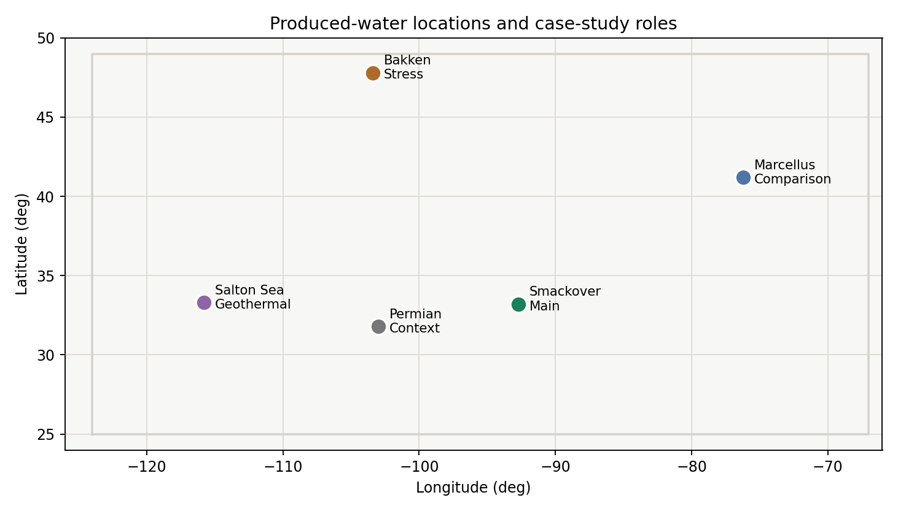
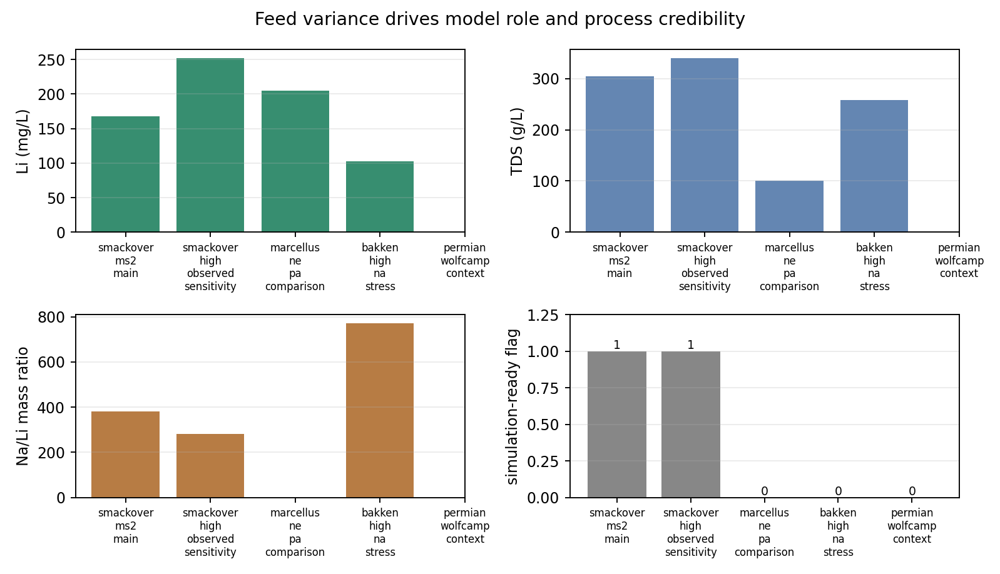
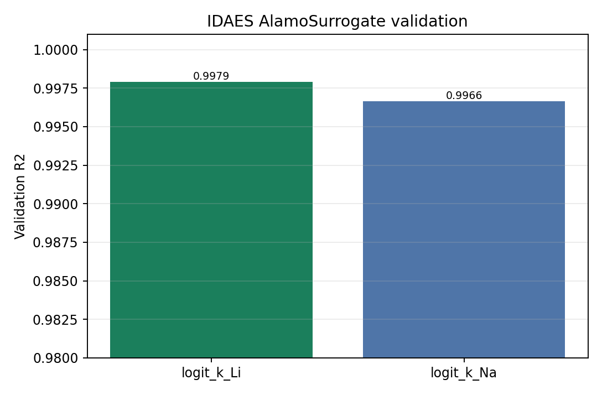
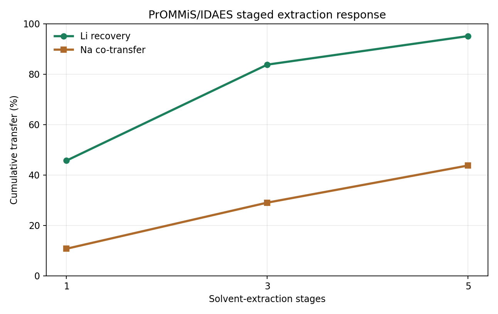
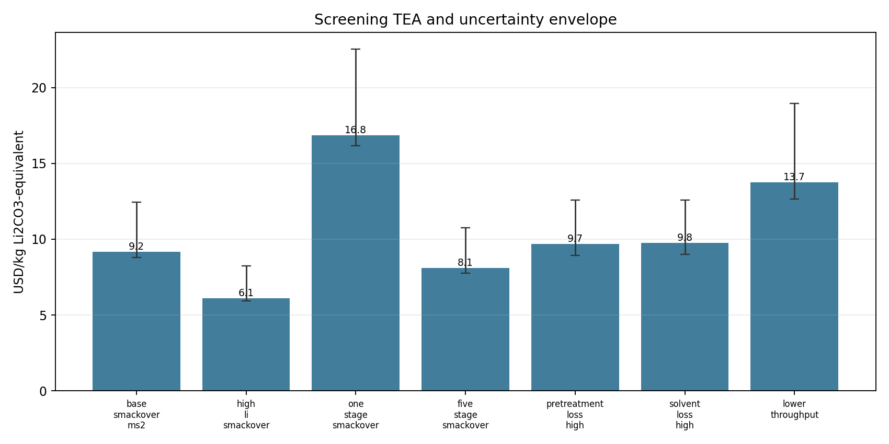
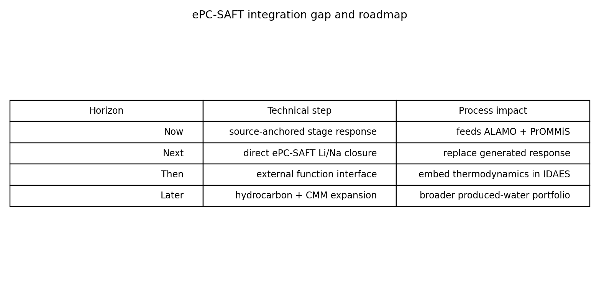
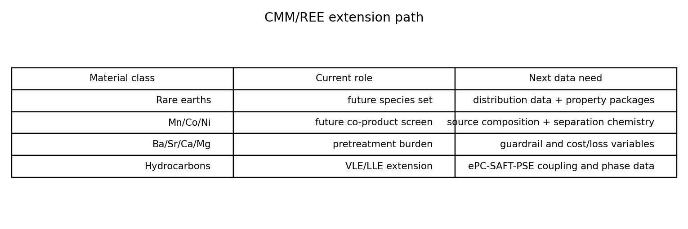
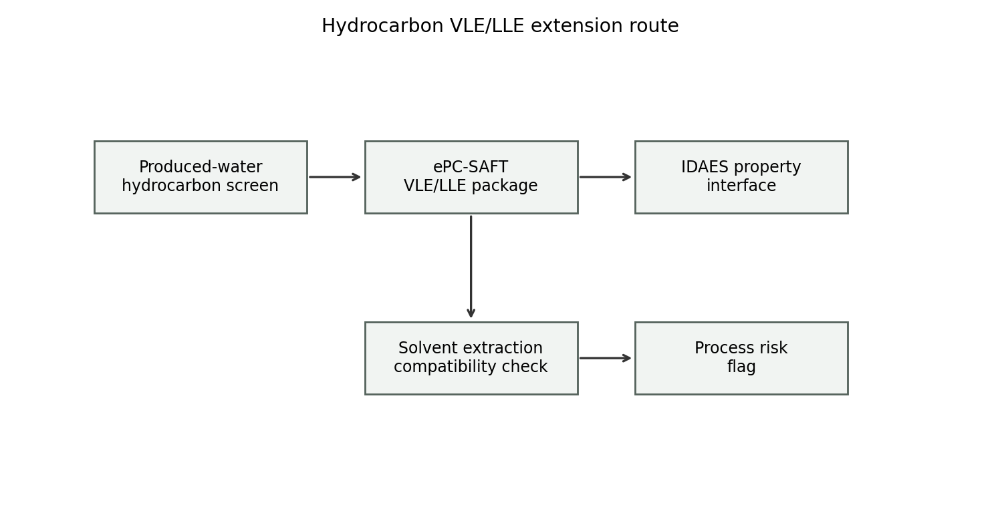

## Internal Decision

Approve the next integration sprint around a working produced-water lithium extraction workflow:

- source-backed feed register
- TBAC/DA DES + TOPO Li/Na stage response
- IDAES AlamoSurrogate and SurrogateBlock
- PrOMMiS/IDAES staged solvent extraction
- screening TEA and uncertainty propagation

The request is model maturation and integration, not project sanction.

## Produced-Water Locations

Smackover is the main case because it combines meaningful lithium grade with source-backed major-ion chemistry. Marcellus, Bakken, Permian, and Salton Sea remain comparison or context cases.

## Feed Variance Controls Credibility

High water volume alone does not make a lithium resource. The case-study table separates simulation-ready Smackover rows from incomplete comparison rows.

## Feed Role Register

| Feed | Role | Simulation use |
|---|---|---|
| Smackover MS-2 | main flowsheet and TEA case | yes |
| Smackover high observed | high-Li sensitivity | yes |
| Marcellus NE PA | comparison card | no |
| Bakken high Na | stress context | no |
| Permian / Wolfcamp | volume and location context | no |

## Pretreatment Boundary

Raw produced water is not the Li/Na extraction feed. Ca, Mg, Sr, Ba, suspended solids, oil, organics, and pretreatment Li loss sit upstream of the Li/Na solvent-extraction model.

## Active Solvent System

The active chemistry is TBAC(1):DA(2) hydrophobic DES + TOPO.

- nominal organic phase: 90 wt% TBAC/DA DES + 10 wt% TOPO
- TBAC:DA molar ratio: 1:2
- temperature: 23 C
- aqueous pH: 10.4

## Two-Domain Stage-Response Design

| Domain | Rows | Purpose |
|---|---:|---|
| source-paper-valid LHS | 625 | protect source-anchor credibility |
| produced-water-centered LHS | 625 | support Smackover UQ and management case |
| source anchors | 3 | preserve reported Li/Na extraction anchors |
| nominal/corner rows | 18 | connect feeds and stress bounds |

Stage-response rows are labeled as source-anchored generated demonstration data when they are not direct ePC-SAFT output.

## IDAES ALAMO Surrogate

The surrogate artifact is an IDAES `AlamoSurrogate` JSON.

| Contract | Value |
|---|---|
| Inputs | `li_mg_L`, `na_mg_L`, `o_to_a_ratio`, `topo_wt_pct` |
| Outputs | `logit_k_Li`, `logit_k_Na` |
| Load path | IDAES `AlamoSurrogate.load_from_file` |
| Process embedding | IDAES `SurrogateBlock` |

## PrOMMiS/IDAES Workflow

The process layer uses real PrOMMiS `SolventExtraction` objects containing IDAES `MSContactor` units. Li and Na transfer terms are active. Chloride transfer is held at zero inside the Li/Na extraction boundary.

## Staged Extraction Result

For the Smackover MS-2 case at O/A = 1 and 10 wt% TOPO, the 3-stage PrOMMiS/IDAES run gives 83.77% cumulative Li recovery and 29.01% Na co-transfer before the screening TEA pretreatment-loss adjustment.

## Screening TEA and UQ

Base Smackover screening intensity is 9.18 USD/kg Li2CO3-equivalent after pretreatment loss, with the sensitivity envelope driven by feed grade, stage count, solvent makeup, and fixed annual charges.

## TEA Assumption Boundary

| Assumption group | Current role |
|---|---|
| pretreatment loss | upstream Li loss sensitivity |
| pretreatment cost | produced-water cleanup burden |
| solvent loss | TBAC/DA DES + TOPO makeup sensitivity |
| annualized charge | normalized project-scale comparison |

These values support internal prioritization and assumption testing.

## ePC-SAFT Bridge Roadmap

The current workflow proves the process-facing path. The next thermodynamic milestone is accepted direct ePC-SAFT Li/Na transfer generation that can replace the source-anchored stage-response layer.

## External Function Path

| Layer | Current artifact | Next interface |
|---|---|---|
| thermodynamics | ePC-SAFT package pin | external function or ePC-SAFT-PSE block |
| surrogate | IDAES AlamoSurrogate JSON | retrain or replace from direct transfer rows |
| process | PrOMMiS/IDAES MSContactor | staged process sensitivity and TEA |
| governance | success-gate report | refreshed gates after direct transfer generation |

## CMM/REE Extension

The present case is Li/Na only. Divalent ions and potential co-products remain registered as pretreatment burden, extension targets, or future species sets.

## Hydrocarbon VLE/LLE Extension

Hydrocarbon-bearing produced water adds a separate VLE/LLE screening need before the solvent extraction model is treated as broadly portable.

## Case-Study Package

| Artifact | Status |
|---|---|
| feed and source registers | pass |
| two-domain stage response | pass |
| IDAES AlamoSurrogate JSON | pass |
| SurrogateBlock smoke check | pass |
| PrOMMiS/IDAES staged extraction | pass |
| screening TEA/UQ | pass |
| executed notebook | pass |
| rendered deck | pass |

## Recommended Next Step

Fund a focused integration sprint to replace the generated stage-response layer with accepted direct ePC-SAFT transfer values, then rerun the same ALAMO, PrOMMiS/IDAES, notebook, and TEA gates.

## Backup: Source Anchors

| Anchor | Value retained |
|---|---:|
| optimized one-stage Li extraction | 48.57% |
| optimized source-definition selectivity | 4.41 |
| model-brine Li extraction | 51.63% |
| model-brine Na extraction | 9.97% |

These anchors bound the stage-response surface used to propagate the downstream workflow.

## Backup: Screening TEA Scenarios

| Scenario | Basis |
|---|---|
| base Smackover MS-2 | 3-stage nominal case |
| high-Li Smackover | feed-grade sensitivity |
| one-stage and five-stage Smackover | stage-count sensitivity |
| high pretreatment loss | upstream loss sensitivity |
| high solvent loss | solvent makeup sensitivity |
| lower throughput | fixed-charge sensitivity |

