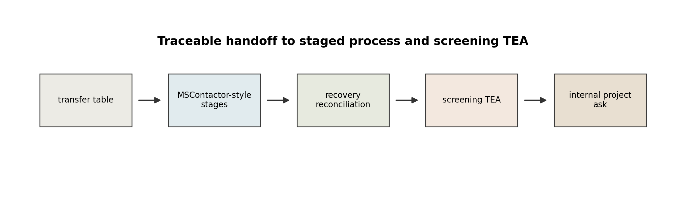
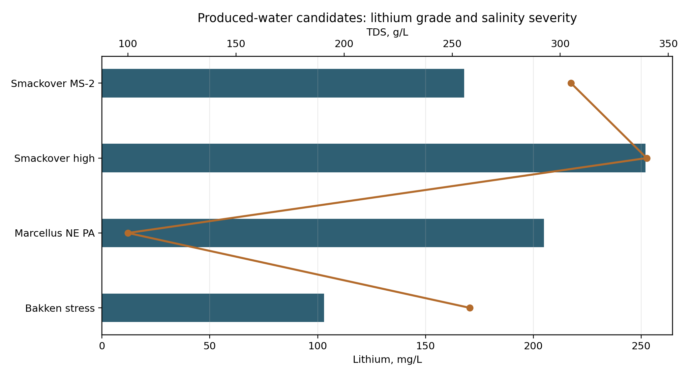
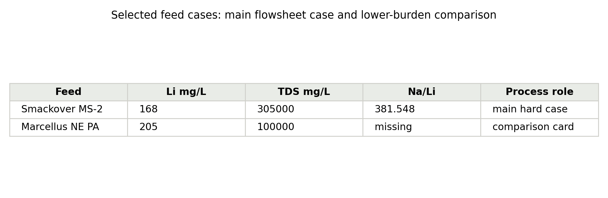
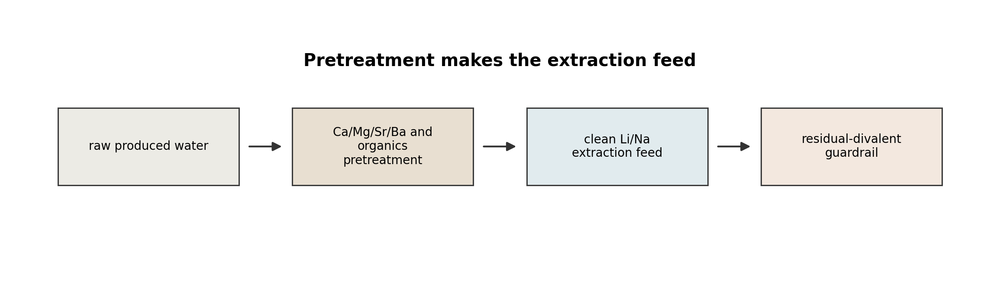
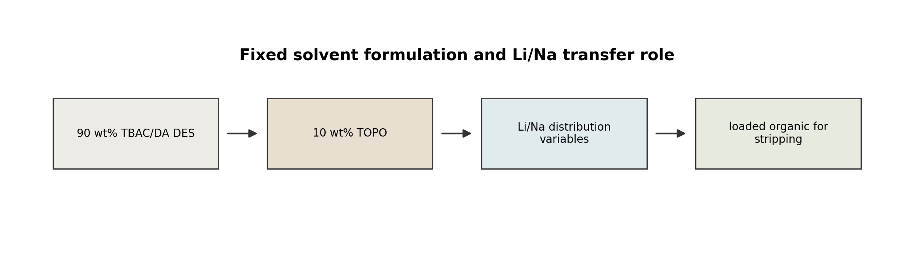
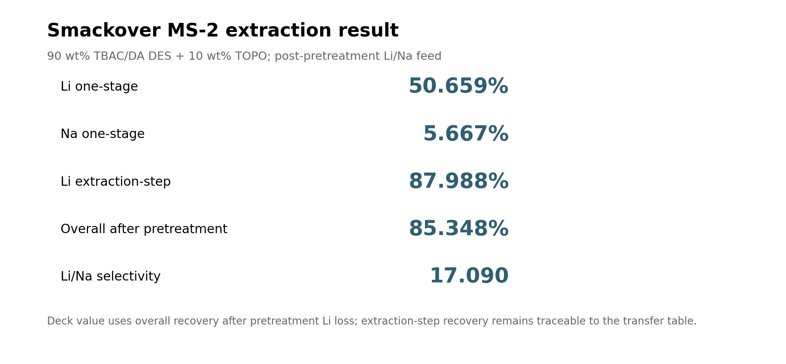
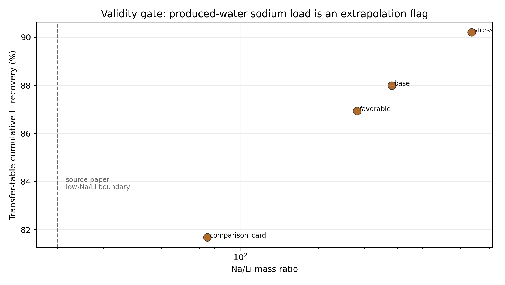
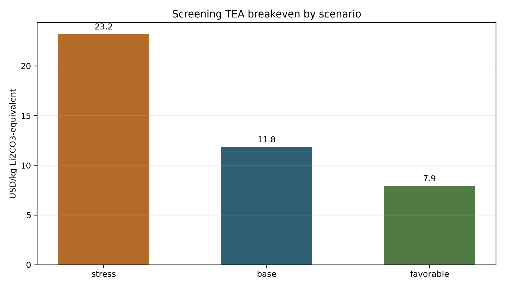

---
format:
  revealjs:
    theme: simple
    slide-number: true
    embed-resources: true
    width: 1600
    height: 900
    transition: none
---

## Internal Project Ask

Approve an internal integration sprint that connects produced-water feed chemistry, ePC-SAFT-calibrated Li/Na transfer variables, PrOMMiS/IDAES staged extraction, and screening TEA.

Decision target: formalize the ePC-SAFT-to-PrOMMiS/IDAES case-study workflow and fund the validation work needed to replace calibrated transfer variables with direct closure when the phase-inventory convention is resolved.

## Why Produced Water

Produced water is a lithium-bearing waste stream with existing handling infrastructure, but feed chemistry controls whether extraction is credible.

The case study prioritizes feed quality, salinity severity, and interference burden over volume-only opportunity claims.

## Candidate Screening

Smackover, Marcellus, Bakken, and Permian do not play the same process role.

| Candidate | Case-study role | Decision |
|---|---|---|
| Smackover MS-2 | main flowsheet case | high-salinity hard case with source-backed major ions |
| Smackover high observed | sensitivity | high-Li sensitivity, not the base case |
| Marcellus NE PA | comparison card | lower-burden comparison until missing ions are sourced |
| Bakken high Na | stress test | high-Na validity stress, not the flagship |

## Selected Feed Cases

Smackover MS-2 is the main flowsheet case. Marcellus NE PA remains a comparison card because Na, Ca, Sr, and Ba are not source-complete in the current feed table.

## Pretreatment Boundary

Raw produced water is not the extraction feed. Ca, Mg, Sr, Ba, suspended solids, oil, organics, and pretreatment Li loss sit upstream of the Li/Na solvent-extraction model.

## Solvent System

`90 wt% TBAC/DA DES + 10 wt% TOPO` is fixed for the main case-study basis. TOPO is fixed at 10 wt% and TBAC:DA is fixed at 1:2.

## ePC-SAFT Role

ePC-SAFT supplies activity, density, distribution, selectivity, and validity information that process models can consume.

| Role | Main-deck message |
|---|---|
| Transfer variables | Process models consume D_Li, D_Na, stage count, O/A, recovery, and validity flags. |
| Validity gate | High Na/Li rows remain extrapolation-flagged. |
| Direct closure | Direct reactive-LLE is not the model of record until the phase-inventory convention closes. |

## Base Extraction Result

The Smackover MS-2 transfer table gives `87.988%` extraction-step Li recovery. The staged process value used in the deck is `85.348%` overall Li recovery after pretreatment Li loss.

## Surrogate And Validity Gate

Produced-water Na/Li ratios exceed the low-Na/Li source-paper design space. PrOMMiS/IDAES should carry the extrapolation flag instead of treating high-Na rows as fully validated.

## PrOMMiS/IDAES Workflow

The process layer consumes the transfer table, applies pretreatment Li loss, stages the Li/Na extraction, and hands reconciled recovery values to screening TEA.

Recovery reconciliation: `same stage count as transfer table; PrOMMiS/IDAES-style recovery includes pretreatment Li loss`.

## Screening TEA

Base screening breakeven is `11.84 USD/kg Li2CO3-equivalent screening breakeven`. Stress and favorable cases bracket the current scaffold at `23.23 USD/kg Li2CO3-equivalent screening breakeven` and `7.92 USD/kg Li2CO3-equivalent screening breakeven`.

All economics are screening TEA values for internal project formalization.

## Roadmap And Ask

| Workstream | Proof artifact | Stop condition |
|---|---|---|
| Direct ePC-SAFT closure | phase-inventory convention scan | direct closure passes validation or remains bounded |
| PrOMMiS/IDAES integration | staged contactor implementation | transfer variables match reconciled recovery table |
| Screening TEA maturation | approved assumption table | solvent loss, regeneration, and equipment basis are reviewed |

Project ask: fund the integration and validation sprint, not commercialization or plant-ready economics.

## Backup: ePC-SAFT Theory Details

ePC-SAFT contributes activity coefficients, fugacity diagnostics, density support, and phase-stability evidence. The current deck uses calibrated transfer variables because direct reactive-LLE closure is not promoted.

## Backup: Solvent-Extraction Definitions

| Quantity | Definition |
|---|---|
| D_Li | Li distribution ratio consumed by staged extraction. |
| D_Na | Na distribution ratio consumed by staged extraction. |
| O/A | organic-to-aqueous mass ratio in the transfer table. |
| Selectivity | D_Li divided by D_Na. |

## Backup: Source-Paper Benchmark Details

The source-paper benchmark layer includes 10 wt% TOPO anchor rows with optimized Li extraction near 48.57% and a model-brine Li/Na extraction row near 51.63% Li and 9.97% Na.

These rows are bridge anchors, not produced-water process simulations.

## Backup: Phase-Inventory Diagnostics

The active diagnostic term is phase-inventory / reaction-coordinate reference-state convention.

The convention scan reports no promoted direct reactive-LLE closure; the case-study deck therefore uses calibrated transfer variables and carries validity flags.

## Backup: Literature Scorecard

| Evidence layer | Deck use | Boundary |
|---|---|---|
| Produced-water feed table | Smackover and comparison-feed basis | missing values remain flagged |
| Solvent extraction benchmark | Li/Na extraction anchor | not Smackover experimental validation |
| ePC-SAFT diagnostics | transfer-variable credibility | direct closure not promoted |
| Process and TEA scaffold | internal project ask | screening TEA only |

## Backup: Full TEA Assumption Table

| Scenario | Li recovery (%) | Solvent loss rate | Stage count | Breakeven metric |
|---|---:|---:|---:|---|
| base_smackover_ms2 | 85.348 | 0.005 | 3 | 11.84 USD/kg Li2CO3-equivalent screening breakeven |
| stress_bakken_high_na | 85.688 | 0.008 | 3 | 23.23 USD/kg Li2CO3-equivalent screening breakeven |
| favorable_smackover_high_li | 85.189 | 0.004 | 3 | 7.92 USD/kg Li2CO3-equivalent screening breakeven |
| comparison_marcellus_card | 79.229 | 0.005 | 3 | 10.21 USD/kg Li2CO3-equivalent screening breakeven |
| sensitivity_pretreatment_li_loss | 80.949 | 0.005 | 3 | 12.35 USD/kg Li2CO3-equivalent screening breakeven |
| sensitivity_solvent_loss | 85.348 | 0.020 | 3 | 30.51 USD/kg Li2CO3-equivalent screening breakeven |
| sensitivity_stage_count_5 | 94.163 | 0.005 | 5 | 11.70 USD/kg Li2CO3-equivalent screening breakeven |
