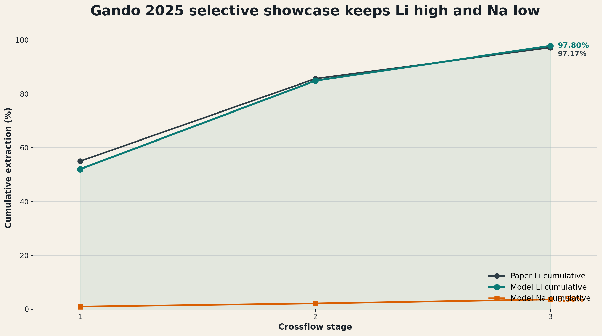

## 0. Technical Thesis {.title-slide}

This deck makes one chemical-engineering argument:

::: {.callout}
Produced-water lithium extraction needs a thermodynamic model that maps basin chemistry into solvent-extraction transfer variables. The benchmark chemistry is the non-ionic HBTA/TOPO/sulfonated-kerosene system; ePC-SAFT is evaluated as the equilibrium backbone for PrOMMiS and IDAES.
:::

- Feed basis: southern Arkansas Smackover brine.
- Solvent chemistry: HBTA/TOPO complexation with selective Li transfer.
- Thermodynamic target: electrolyte liquid-liquid equilibrium and ion-specific distribution.
- Process target: staged extraction, surrogate generation, and IDAES costing.

::: {.notes}
Restrict quantitative claims to source-backed literature, generated validation tables, and explicitly labeled model outputs. Ionic-liquid systems are context only, not the active benchmark.
:::

::: {.notes}
Open with the implementation need, not with a generic lithium motivation. The audience should understand within the first minute that this is a case for thermodynamic integration, not a broad solvent-discovery survey.
:::

# 1. Basin Thermodynamic Basis {.section-divider}

## 1.1 Produced Water Is Not One Feed {.tight}

| Basin | Representative lithium signal | Representative TDS signal | Why it matters |
|---|---|---|---|
| Appalachian | Marcellus subsets reach `127-205 mg/L` Li | Often `>100,000 mg/L` TDS | High Li, chemically variable |
| Permian | Wolfcamp average near `14 ppm` Li | `<25-140 g/L` TDS range | High water volume, lower Li grade |
| Williston | Brines can exceed `100 mg/L` Li | Bakken/Three Forks near `308 g/L` TDS | Salinity can dominate pretreatment |
| Smackover | Observed Li about `1-477 mg/L` | `156,000-340,000 mg/L` TDS | Premium but thermodynamically hard |

::: {.callout}
The case study starts with basin screening because the same extraction train will not behave the same across these feeds.
:::

::: {.notes}
This is the first premise. If produced water were a single feed, a simple recovery factor might be defensible. It is not a single feed, so the model needs to carry chemistry.
:::

## 1.2 Why Smackover Is The Flagship Case

::: {.panel}
**Why this location makes sense**

- Southern Arkansas Smackover combines high Li with very high salinity, so the chemistry is both valuable and hard.
- Smackover and Marcellus are the more favorable U.S. plays on major-metals-to-lithium and divalent-to-lithium ratios in the cited screening work.
- Arkansas already has commercial bromine and brine-handling infrastructure.
- That combination connects chemistry, location, and process deployment.
:::

| Signal | Smackover basis |
|---|---|
| Li range | observed wells span about `1-477 mg/L` |
| TDS range | observed samples span `156,000-340,000 mg/L` |
| Median TDS | current observation-set median is `305,000 mg/L` |
| Infrastructure | existing Arkansas bromine/brine operations |

::: {.notes}
The key line is: Smackover wins not because it is easy, but because it is valuable and thermodynamically unforgiving. That is exactly where an electrolyte EoS earns its keep.
:::

## 1.3 Smackover Feed Basis {.tight}

| Case | Row | Li (mg/L) | TDS (mg/L) | Na/Ca/Mg (mg/L) | Role |
|---|---|---:|---:|---|---|
| Low observed | `SH-2` | `11.7` | `156,000` | `37,100 / 13,900 / 2,250` | Lower source bound |
| Base observed | `MS-2` | `168` | `305,000` | `64,100 / 36,900 / 3,310` | Median-TDS base proxy |
| High observed | `BR-2` | `252` | `340,000` | `70,800 / 39,900 / 3,130` | High-TDS/high-Li proxy |

::: {.callout}
These are source rows from the USGS southern-Arkansas Smackover data release after duplicate and blank rows are excluded. The separate `100/200/400 mg/L Li` rows are sensitivity cases, not direct well samples.
:::

::: {.notes}
This slide shows true source composition without implying that the Shan/Gando extraction feed is a Smackover sample.
:::

## 1.4 Selected Base Brine {.tight}

| Field | Value |
|---|---|
| Source row | `MS-2 / MSPU 4-W1` |
| Formation | `Smackover` |
| Li | `168 mg/L` |
| TDS | `305,000 mg/L` |
| Na / Ca / Mg | `64,100 / 36,900 / 3,310 mg/L` |
| Cl / Br | `174,000 / 2,700 mg/L` |

::: {.callout}
The feed is Smackover-specific. The extraction chemistry is Shan/Gando HBTA/TOPO. The model couples a source-backed brine to a literature-backed non-ionic extraction chemistry without claiming a fully calibrated Arkansas extraction experiment.
:::

::: {.notes}
This slide makes the case concrete while preserving the source-vs-chemistry boundary.
:::

## 1.5 Critical Minerals And REE Boundary {.tight}

| Group | What the Smackover source table supports | How to present it |
|---|---|---|
| Reported trace fields | Fe, Mn, Zn, Al, As, Be, Cd, Co, Cu, Cr, Hg, Mo, Ni, Pb, U, V | Use as trace/pretreatment context, with censoring caveats |
| REE | `not_reported` in the source table | Do not infer; make this a future-data need |

::: {.notes}
Many trace-metal values are censored thresholds, so avoid treating medians as exact resource grades. The key message is disciplined: REE are not source-supported for this feed yet.
:::

## 1.6 Variables The Case Must Vary

| Axis | Why it matters | Process consequence |
|---|---|---|
| Li concentration | Sets value and concentration driving force | Changes recovery target and stage count |
| TDS / NaCl load | Changes ionic strength and activity behavior | Moves distribution behavior and surrogate validity |
| Competing ions | Mg, Ca, Sr, Ba, and Na affect selectivity | Changes pretreatment and solvent burden |
| Solvent / extractant chemistry | Determines whether selective transfer is plausible | Changes \(D_i\), selectivity, and loaded-solvent composition |
| O/A ratio | Directly affects stage transfer | Becomes a design and optimization variable |

::: {.notes}
This slide makes the problem multidimensional without inventing unsupported ranges. It sets up why a thermodynamic engine is needed before a process optimizer starts sampling.
:::

# 2. ePC-SAFT Thermodynamic Role {.section-divider}

## 2.1 The Model Gap

:::: {.columns}
::: {.column width="50%"}
::: {.panel}
**What weak placeholders can do**

- Reproduce a narrow demonstration point
- Provide a quick stage recovery factor
- Run fast inside a flowsheet
- Help debug material balances
:::
:::
::: {.column width="50%"}
::: {.panel}
**What they cannot defend**

- Basin-to-basin extrapolation
- Hypersaline electrolyte behavior
- Solvent and O/A sensitivity
- Ion-specific distribution behavior
- Trust-region bounds for optimization
:::
:::
::::

::: {.callout}
The process model needs a physical equilibrium layer before the surrogate or optimizer is meaningful.
:::

::: {.notes}
Be careful not to oversell. This is a replacement for unsupported transfer assumptions, not a claim that ePC-SAFT solves kinetics, hydraulics, or plant economics by itself.
:::

## 2.2 What ePC-SAFT Adds

| Modeling need | ePC-SAFT contribution | Why it is novel for this case |
|---|---|---|
| Hypersaline brine | Electrolyte activity and phase-equilibrium structure | Salinity becomes a modeled variable, not a correction factor |
| Aqueous/organic split | Phase compositions and phase fractions | The extraction stage gets a thermodynamic target |
| Ion partitioning | Distribution ratios and selectivity metrics | Li movement can be separated from bulk salt movement |
| Sensitivity surfaces | Response to TDS, O/A, solvent, and feed composition | Surrogates can be trained inside a meaningful region |
| Diagnostics | Stability, convergence, and phase-distance checks | Failed or collapsed points do not silently become process data |

::: {.notes}
The novelty claim is reusable insight. The model lets the project ask where the chemistry should work, why the answer changes across basins, and what variables the process model should receive.
For this deck, those variables are transfer variables, not equipment performance coefficients.
:::

## 2.3 Rezaee 2026 As A Parameter-Fitting Smoke Test {.tight}

| What Rezaee gives | How this deck should use it |
|---|---|
| DES/TOPO lithium extraction modeling with tabulated PC-SAFT-style parameters | Package regression and equilibrium smoke test |
| Organic phase modeled with PC-SAFT | Do not cite as full ePC-SAFT organic-phase closure |
| Aqueous electrolyte phase modeled with ePC-SAFT | Useful support for the aqueous-brine side of the bridge |
| Fitted organic interactions and product pseudo-species | Useful parameterization pattern, not Shan/Gando chemistry |

::: {.callout}
Rezaee is a method lead and runtime test, not the final HBTA/TOPO model.
:::

::: {.notes}
This slide prevents overclaiming. It answers the obvious reviewer question: yes, the new paper is useful, but it used PC-SAFT for the organic side and ePC-SAFT for the aqueous side. The case study still needs its own HBTA/TOPO parameterization.
:::

## 2.4 Solvent Candidate Scorecard {.tight}

| Priority | System | Role | Status |
|---:|---|---|---|
| 1 | HBTA + TOPO + sulfonated kerosene | Flagship | Field-water evidence, source-regressed Li/Na stage model, missing full multication parameter payload |
| 2 | D2EHDTPA + BuPhen + octanol + n-dodecane | Best non-HBTA backup | Strong multication selectivity, blocked by missing parameter set |
| 3 | TBAC + decanoic-acid DES + TOPO | Parameter-regression pilot | Rezaee smoke test runs; not the flagship chemistry |
| 4 | TBP + FeCl3/HCl | Mechanistic backup | Useful high-Mg comparison, process-burden and parameter gaps |

::: {.notes}
This ranking keeps the active benchmark conventional and non-ionic while still identifying backup solvent families.
:::

## 2.5 Limitation Of Fixed-Coefficient Crossflow

:::: {.columns}
::: {.column width="50%"}
::: {.panel}
**Placeholder limitation**

- The legacy Jang-style crossflow placeholder reaches only `39.96%` cumulative Li extraction after ten contacts.
- Sodium still reaches `38.05%` cumulative extraction in that same chain.
- It is a limitation baseline, not a flagship produced-water case.
:::
:::
::: {.column width="50%"}
::: {.panel}
**Why it was not enough**

- fixed surrogate chemistry
- weak Li-over-Na separation
- no bridge to trust-region sampling or ALAMO
:::
:::
::::

::: {.notes}
This slide creates the contrast. The older result is not embarrassing; it is the baseline that proves why a better thermodynamic/chemistry architecture is needed.
:::

# 3. Selective Extraction Model {.section-divider}

## 3.1 One-Stage Selective Split

:::: {.columns}
::: {.column width="45%"}
::: {.panel}
**MS-2 O/A = 1 stage result**

- Li extraction: `47.2846%`
- Na extraction: `0.0131%`
- \(D_{Li} = 0.8970\)
- \(S_{Li/Na} = 6840.1\)
- Raffinate Li: `88.56 mg/L`
- Activity correction: ePC-SAFT aqueous gamma
:::

::: {.callout}
Source-regressed Li/Na stage solve; not a full multication reactive LLE flash.
:::
:::
::: {.column width="55%"}
::: {.panel}
**What changed from the old wrapper**

- The chemistry now carries the literature-backed `2 HBTA : 1 TOPO : 1 Li` complex stoichiometry.
- The aqueous Li/Na activity correction is evaluated by ePC-SAFT when available.
- The old selective wrapper remains only as historical support and fallback context.
- The current stage-output table carries extraction, distribution, selectivity, and validity labels.
:::
:::
::::

::: {.notes}
The important contrast is selective transfer: lithium moves materially while sodium barely moves. The model is source-regressed against literature anchors and reused across feed cases, but it is still not a full organic-phase ePC-SAFT closure.
:::

## 3.2 Li/Na Regression Closure {.tight}

| Anchor | Zotero key | Target | Prediction | Residual |
|---|---|---:|---:|---:|
| Stage 1 Li cumulative extraction | `JUNBXVTI` | `54.95%` | `54.8882%` | `-0.0618 pp` |
| Stage 2 Li cumulative extraction | `JUNBXVTI` | `85.60%` | `85.7224%` | `+0.1224 pp` |
| Stage 3 Li cumulative extraction | `JUNBXVTI` | `97.17%` | `97.0385%` | `-0.1315 pp` |
| Li/Na selectivity lower-bound anchor | `9LJWDC7E` | `2100` | `2100.008` | `+0.008` |

::: {.callout}
This is the current predictive closure: Li/Na staged transfer from one source-regressed parameter payload. Ca, Mg, Ba, Sr, diluent, and complex parameters remain explicit limits.
:::

## 3.3 Multi-Stage Performance

:::: {.columns}
::: {.column width="56%"}
::: {.figure-frame}
{fig-alt="Cumulative extraction profile across three stages for the selective lithium extraction showcase"}
:::
:::
::: {.column width="44%"}
::: {.panel}
**Three-stage reactive-stage chain**

- Stage 1 cumulative Li extraction: `47.2846%`
- Stage 2 cumulative Li extraction: `89.5753%`
- Stage 3 model Li extraction: near-total
- Stage 3 cumulative Na extraction: `0.1160%`
- Costing recovery is capped at the `97.17%` literature anchor
:::
:::
::::

::: {.notes}
The near-total stage-three value is useful as a design signal, not as a final physical claim. In the costing tables it is capped to the Shan/Gando three-stage anchor.
:::

## 3.4 Thermodynamic Insight

:::: {.columns}
::: {.column width="48%"}
::: {.panel}
**The old question**

Can this solvent extract lithium from this brine?
:::

::: {.panel}
**The stronger question**

Where should this chemistry work, how does the answer change with basin chemistry, and what stage variables should enter a process model?
:::
:::
::: {.column width="52%"}
::: {.panel}
**Why ePC-SAFT changes the question**

- It turns feed chemistry into equilibrium states.
- It lets salt load and O/A ratio become computable sensitivities.
- It provides distribution and selectivity variables, not only recovery percentages.
:::
:::
::::

::: {.notes}
This is the main "novel insight" slide. The idea is not just a better lithium number. It is a more reusable way to reason from location to chemistry to process design.
:::

# 4. PrOMMiS / IDAES Process Bridge {.section-divider}

## 4.1 From Equilibrium To Transfer Variables

| Process-model need | ePC-SAFT-derived quantity | Use in PrOMMiS / IDAES |
|---|---|---|
| Feed state | \(z_i\), TDS, Li/Na/Mg/Ca/Sr/Ba/Cl basis, temperature | Basin-specific solvent-extraction inlet |
| Phase split | aqueous and organic compositions, phase fraction | Equilibrium target or closure for a stage |
| Transfer strength | \(D_i = C_{i,org}/C_{i,aq}\) | Distribution behavior in material balances |
| Selectivity | \(S_{Li/Na}\), later \(S_{Li/Mg}\), \(S_{Li/Ca}\) | Separation constraints and solvent screening |

::: {.callout}
PrOMMiS and IDAES do not just need a lithium recovery number. They need a defensible map from produced-water chemistry to stage transfer variables.
:::

::: {.notes}
This is the concrete software interface. Percent extraction is the audience-friendly number; the unit model needs compositions, phase splits, distribution ratios, selectivity, and diagnostics.
:::

## 4.2 Transfer-Variable Contract

For process integration, the ePC-SAFT output should be treated as the following structured contract:

| Variable | Definition | Why PrOMMiS / IDAES needs it |
|---|---|---|
| \(\eta_i\) | stage removal \(= (C_{i,in} - C_{i,out}) / C_{i,in}\) | Links chemistry to process-wide recovery objectives |
| \(D_i\) | \(C_{i,org} / C_{i,aq}\) | Controls staged transfer in material balance equations |
| \(S_{Li/Na}\), \(S_{Li/Mg}\), \(S_{Li/Ca}\) | Selectivity ratios from stage/phase outputs | Enables solvent and design comparison without refitting fixed coefficients |
| Validity flags | residuals, phase flags, domain bounds | Prevents brittle points from entering surrogate or optimizer datasets |

::: {.callout}
This keeps the story concrete: ePC-SAFT computes the transfer map; PrOMMiS/IDAES consumes it.
:::

::: {.notes}
This slide is the strongest technical anchor for implementation reviewers because it is explicit about what gets passed across process boundaries.
:::

## 4.3 Why This Belongs In PrOMMiS / IDAES

::: {.process-grid}
::: {.process-step}
**1. Offline engine**
Run ePC-SAFT outside the flowsheet to generate equilibrium tables over feed chemistry, O/A ratio, and solvent conditions.
:::
::: {.process-step}
**2. Surrogate layer**
Fit ALAMO or another surrogate inside a documented trust region so optimization is fast and bounded.
:::
::: {.process-step}
**3. External function**
Expose high-fidelity calls for studies where direct thermodynamic solves are worth the cost.
:::
::: {.process-step}
**4. Process model**
Use PrOMMiS/IDAES for staged extraction, recycle, stripping, costing hooks, and optimization.
:::
:::

::: {.notes}
This is the recommended maturity ladder. Do not pitch direct coupling as the only path. The lowest-risk first step is an offline data generator that feeds a bounded surrogate.
:::

## 4.4 Formal IDAES Costing Scaffold {.tight}

| Costing block | Current basis | Needed before formal TEA |
|---|---|---|
| Feed and annual basis | Smackover base feed; `100/1000/10000 m3/day` scenarios | approved flowrate and uptime |
| Pretreatment | IDAES/Pyomo scenario expression from model inputs | removal target, reagent use, waste handling |
| Extraction/contacting | three-stage HBTA/TOPO reactive-stage solve | contactor sizing, residence time, solvent inventory |
| Solvent makeup/loss | low/base/high placeholder per m3 feed | HBTA/TOPO/diluent prices and loss rate |
| Concentration and Li2CO3 precipitation | product-purity anchor `99.28%`; recovery capped at `97.17%` | evaporation duty, carbonate reagent, product spec |

::: {.callout}
The formal IDAES/Pyomo layer computes production, revenue, annual operating cost, annualized contactor CAPEX, breakeven Li2CO3 price, and net-before-tax scenario values.
:::

::: {.notes}
The assumptions are scenario placeholders, not vendor quotes.
:::

## 4.5 Implementation Requirements

:::: {.columns}
::: {.column width="50%"}
::: {.panel}
**Add ePC-SAFT as the thermodynamic backbone**

- property/equilibrium service for electrolyte LLE
- documented species and feed basis
- diagnostics carried with every result
- reproducible dataset generation
:::
:::
::: {.column width="50%"}
::: {.panel}
**Use PrOMMiS/IDAES for the process system**

- solvent-extraction stage balances
- multi-stage contactors
- surrogate and external-function interfaces
- flowsheet optimization and costing hooks
:::
:::
::::

::: {.callout}
The sell is simple: ePC-SAFT supplies the equilibrium evidence; PrOMMiS/IDAES turns that evidence into a process model.
:::

::: {.notes}
This slide is the ask. It should leave no ambiguity about what you want: implement ePC-SAFT into the ecosystem so these cases can move from isolated scripts into reusable process models.
:::

## 4.6 Remaining Engineering Work

| Priority | Work item | Why it matters |
|---|---|---|
| 1 | Extract Zhang 2017 distribution, O/A, temperature, and capacity data | Improves identifiability of the Li/Na transfer law |
| 2 | Add explicit HBTA, TOPO, diluent, and Li-complex parameter regression | Moves from source-regressed transfer to reactive ePC-SAFT closure |
| 3 | Build a PrOMMiS MSContactor validation case | Tests convergence and material-balance consistency under staged operation |
| 4 | Replace Class-5 costing assumptions with engineering ranges | Improves economic credibility before TEA-style interpretation |

::: {.notes}
This gives you a transparent ending if someone asks what is already proven versus what remains. It also turns the next work into a clear roadmap rather than a vague promise.
:::

# 5. Backup: Sensitivity Expansion {.section-divider}

## 5.1 Next-Step Sensitivity Expansion {.backup-slide .small-text}

- Re-run the selective case across basin-style feed envelopes:
  - Appalachian high-Li case
  - Permian volume-driven low-grade case
  - Williston high-TDS case
  - Smackover premium-brine case
- Keep the next design-of-experiments table in Markdown so trust-region bounds and surrogate regions are explicit.
- Add a PrOMMiS/IDAES interface table for every generated variable: units, species basis, source basis, and validity limits.
- Keep the narrative in one place: screening, thermodynamics, selective result, and process-design interface.

::: {.notes}
This backup slide is the roadmap for the next systematic screening campaign. It should be shown when someone asks how this becomes more than one case.
:::
