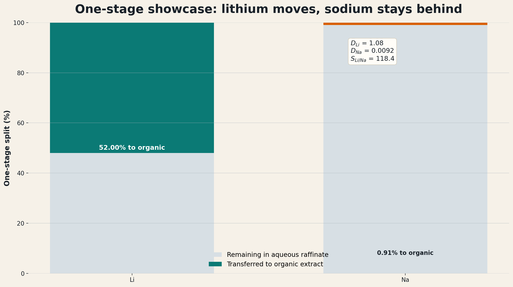

## Why This Case Study Exists {.title-slide}

This deck is the evidence backbone for one implementation argument:

::: {.callout}
Produced-water lithium extraction needs a thermodynamic engine that can turn basin chemistry into solvent-extraction transfer variables. ePC-SAFT is the candidate backbone for that role in PrOMMiS and IDAES.
:::

- The location story is southern Arkansas Smackover.
- The process story is selective aqueous/organic lithium extraction.
- The modeling story is electrolyte LLE plus chemistry-specific selectivity.
- The software story is PrOMMiS/IDAES integration through equilibrium data, surrogates, or external functions.

::: {.notes}
Open with the implementation need, not with a generic lithium motivation. The audience should understand within the first minute that this is a case for why ePC-SAFT belongs in the process-modeling ecosystem.
:::

# Basin Choice {.section-divider}

## Produced Water Is Not One Feed {.tight}

| Basin | Representative lithium signal | Representative TDS signal | Why it matters |
|---|---|---|---|
| Appalachian | Marcellus median Li reaches `127-205 mg/L` in cited PA subsets | Produced water commonly exceeds `100,000 mg/L` TDS | High Li, but still hypersaline and chemically variable |
| Permian | Wolfcamp average Li is about `14 ppm`; top water-producing formations run `1-30 ppm` | Wolfcamp TDS spans roughly `<25 g/L` to `100-140 g/L` | Huge water volume does not mean premium lithium grade |
| Williston | Brines can exceed `100 mg/L` Li and reach about `200 mg/L` in deeper basin brines | Bakken/Three Forks average TDS is about `308 g/L` | Salinity can dominate pretreatment difficulty |
| Smackover | Observed Li spans about `1-477 mg/L`; many wells exceed `100 mg/L` | Southern-Arkansas Smackover samples span `156,000-340,000 mg/L` TDS; clean-sample median is `305,000 mg/L` | Premium lithium case, but thermodynamically unforgiving |

::: {.callout}
The case study starts with basin screening because the same extraction train will not behave the same across these feeds.
:::

::: {.notes}
This is the first premise. If produced water were a single feed, a simple recovery factor might be defensible. It is not a single feed, so the model needs to carry chemistry.
:::

## Why Smackover Is The Flagship Case

:::: {.columns}
::: {.column width="55%"}
::: {.panel}
### Why this location makes sense

- Southern Arkansas Smackover combines high Li with very high salinity, so the chemistry is both valuable and hard.
- Smackover and Marcellus are the more favorable U.S. plays on major-metals-to-lithium and divalent-to-lithium ratios in the cited screening work.
- Arkansas already has commercial bromine and brine-handling infrastructure.
- That combination connects chemistry, location, and process deployment.
:::
:::
::: {.column width="45%"}
::: {.kpi-grid}
::: {.kpi-card}
### Li range
Observed wells span about `1-477 mg/L`
:::
::: {.kpi-card}
### TDS range
Observed samples span `156,000-340,000 mg/L`
:::
::: {.kpi-card}
### Median TDS
Current observation-set median is `305,000 mg/L`
:::
::: {.kpi-card}
### Infrastructure
Existing Arkansas bromine/brine operations
:::
:::
:::
::::

::: {.notes}
The key line is: Smackover wins not because it is easy, but because it is valuable and thermodynamically unforgiving. That is exactly where an electrolyte EoS earns its keep.
:::

## What The Case Must Vary

| Axis | Why it matters | Process consequence |
|---|---|---|
| Li concentration | Sets value and concentration driving force | Changes recovery target and stage count |
| TDS / NaCl load | Changes ionic strength and activity behavior | Moves distribution behavior and surrogate validity |
| Competing ions | Mg, Ca, Sr, Ba, and Na affect selectivity | Changes pretreatment and solvent burden |
| Solvent / extractant chemistry | Determines whether selective transfer is plausible | Changes \(D_i\), selectivity, and loaded-solvent composition |
| O/A ratio | Directly affects stage transfer | Becomes a design and optimization variable |
| Site context | Infrastructure and water handling affect deployment | Determines whether a chemistry win matters commercially |

::: {.notes}
This slide makes the problem multidimensional without inventing unsupported ranges. It sets up why a thermodynamic engine is needed before a process optimizer starts sampling.
:::

# Why ePC-SAFT {.section-divider}

## The Model Gap

:::: {.columns}
::: {.column width="50%"}
::: {.panel}
### What weak placeholders can do

- Reproduce a narrow demonstration point
- Provide a quick stage recovery factor
- Run fast inside a flowsheet
- Help debug material balances
:::
:::
::: {.column width="50%"}
::: {.panel}
### What they cannot defend

- Basin-to-basin extrapolation
- Hypersaline electrolyte behavior
- Solvent and O/A sensitivity
- Ion-specific distribution behavior
- Trust-region bounds for optimization
:::
:::
::::

::: {.callout}
The case for ePC-SAFT is not that every direct call is easy. The case is that the process model needs a physical equilibrium layer before the surrogate or optimizer is meaningful.
:::

::: {.notes}
Be careful not to oversell. This is a replacement for unsupported transfer assumptions, not a claim that ePC-SAFT solves kinetics, hydraulics, or plant economics by itself.
:::

## What ePC-SAFT Adds

| Modeling need | ePC-SAFT contribution | Why it is novel for this case |
|---|---|---|
| Hypersaline brine | Electrolyte activity and phase-equilibrium structure | Salinity becomes a modeled variable, not a correction factor |
| Aqueous/organic split | Phase compositions and phase fractions | The extraction stage gets a thermodynamic target |
| Ion partitioning | Distribution ratios and selectivity metrics | Li movement can be separated from bulk salt movement |
| Sensitivity surfaces | Response to TDS, O/A, solvent, and feed composition | Surrogates can be trained inside a meaningful region |
| Diagnostics | Stability, convergence, and phase-distance checks | Failed or collapsed points do not silently become process data |

::: {.notes}
The novelty claim is reusable insight. The model lets the project ask where the chemistry should work, why the answer changes across basins, and what variables the process model should receive.
:::

## What We Could Not Do Before

:::: {.columns}
::: {.column width="50%"}
::: {.panel}
### Placeholder limitation

- The legacy Jang-style crossflow placeholder reaches only `39.96%` cumulative Li extraction after ten contacts.
- Sodium still reaches `38.05%` cumulative extraction in that same chain.
- That is useful as a debugging scaffold, not as a flagship produced-water case.
:::
:::
::: {.column width="50%"}
::: {.panel}
### Why it was not enough

- Fixed surrogate chemistry
- Weak Li-over-Na separation story
- No strong bridge to trust-region sampling or ALAMO
- Not credible as a basin-specific produced-water showcase
:::
:::
::::

::: {.notes}
This slide creates the contrast. The older result is not embarrassing; it is the baseline that proves why a better thermodynamic/chemistry architecture is needed.
:::

# Selective Extraction Showcase {.section-divider}

## One-Stage Selective Split

:::: {.columns}
::: {.column width="45%"}
::: {.panel}
### Nominal one-stage result

- Li extraction: `52.0047%`
- Na extraction: `0.9067%`
- \(D_{Li} = 1.0835\)
- \(D_{Na} = 0.009150\)
- \(S_{Li/Na} = 118.4138\)
- Raffinate Li: `28.7972 mg/L`
:::

::: {.callout}
Frame this as the current Smackover-like high-TDS selective extraction engine, not as a fully calibrated Arkansas-well flowsheet.
:::
:::
::: {.column width="55%"}
::: {.figure-frame}
{fig-alt="One-stage species split chart for the selective lithium extraction showcase"}
:::
:::
::::

::: {.notes}
The important contrast is selective transfer: lithium moves materially while sodium barely moves. The wrapper is not a weakness; it is the explicit chemistry layer on top of the phase-split backbone.
:::

## Multi-Stage Performance

:::: {.columns}
::: {.column width="56%"}
::: {.figure-frame}
{fig-alt="Cumulative extraction profile across three stages for the selective lithium extraction showcase"}
:::
:::
::: {.column width="44%"}
::: {.panel}
### Three-stage selective chain

- Stage 1 cumulative Li extraction: `52.0047%`
- Stage 2 cumulative Li extraction: `84.8499%`
- Stage 3 cumulative Li extraction: `97.8025%`
- Stage 3 cumulative Na extraction: `3.5827%`
- Stage 3 \(D_{Li} = 5.8941\)
- Stage 3 \(S_{Li/Na} = 382.7454\)
:::
:::
::::

::: {.notes}
If only one quantitative hero slide survives, use this one. It answers what the current workflow can show now that the placeholder could not.
:::

## The Thermodynamic Insight

:::: {.columns}
::: {.column width="48%"}
::: {.panel}
### The old question

Can this solvent extract lithium from this brine?
:::

::: {.panel}
### The stronger question

Where should this chemistry work, how does the answer change with basin chemistry, and what stage variables should enter a process model?
:::
:::
::: {.column width="52%"}
::: {.panel}
### Why ePC-SAFT changes the question

- It turns feed chemistry into equilibrium states.
- It lets salt load and O/A ratio become computable sensitivities.
- It provides distribution and selectivity variables, not only recovery percentages.
- It gives validity diagnostics that a surrogate or optimizer can respect.
:::
:::
::::

::: {.notes}
This is the main "novel insight" slide. The idea is not just a better lithium number. It is a more reusable way to reason from location to chemistry to process design.
:::

# PrOMMiS / IDAES Bridge {.section-divider}

## From Equilibrium To Transfer Variables

| Process-model need | ePC-SAFT-derived quantity | Use in PrOMMiS / IDAES |
|---|---|---|
| Feed state | \(z_i\), TDS, Li/Na/Mg/Ca/Sr/Ba/Cl basis, temperature | Basin-specific solvent-extraction inlet |
| Phase split | aqueous and organic compositions, phase fraction | Equilibrium target or closure for a stage |
| Transfer strength | \(D_i = C_{i,org}/C_{i,aq}\) | Distribution behavior in material balances |
| Selectivity | \(S_{Li/Na}\), later \(S_{Li/Mg}\), \(S_{Li/Ca}\) | Separation constraints and solvent screening |
| Stage outlets | raffinate and loaded-organic compositions | Multi-stage initialization and validation |
| Validity bounds | convergence, phase distance, residuals | Trust-region flags for surrogates and optimizers |

::: {.callout}
PrOMMiS and IDAES do not just need a lithium recovery number. They need a defensible map from produced-water chemistry to stage transfer variables.
:::

::: {.notes}
This is the concrete software interface. Percent extraction is the audience-friendly number; the unit model needs compositions, phase splits, distribution ratios, selectivity, and diagnostics.
:::

## Why This Belongs In PrOMMiS / IDAES

::: {.process-grid}
::: {.process-step}
### 1. Offline engine
Run ePC-SAFT outside the flowsheet to generate equilibrium tables over feed chemistry, O/A ratio, and solvent conditions.
:::
::: {.process-step}
### 2. Surrogate layer
Fit ALAMO or another surrogate inside a documented trust region so optimization is fast and bounded.
:::
::: {.process-step}
### 3. External function
Expose high-fidelity calls for studies where direct thermodynamic solves are worth the cost.
:::
::: {.process-step}
### 4. Process model
Use PrOMMiS/IDAES for staged extraction, recycle, stripping, costing hooks, and optimization.
:::
:::

::: {.notes}
This is the recommended maturity ladder. Do not pitch direct coupling as the only path. The lowest-risk first step is an offline data generator that feeds a bounded surrogate.
:::

## The Implementation Ask

:::: {.columns}
::: {.column width="50%"}
::: {.panel}
### Add ePC-SAFT as the thermodynamic backbone

- property/equilibrium service for electrolyte LLE
- documented species and feed basis
- diagnostics carried with every result
- reproducible dataset generation
:::
:::
::: {.column width="50%"}
::: {.panel}
### Use PrOMMiS/IDAES for the process system

- solvent-extraction stage balances
- multi-stage contactors
- surrogate and external-function interfaces
- flowsheet optimization and costing hooks
:::
:::
::::

::: {.callout}
The sell is simple: ePC-SAFT supplies the equilibrium evidence; PrOMMiS/IDAES turns that evidence into a process model.
:::

::: {.notes}
This slide is the ask. It should leave no ambiguity about what you want: implement ePC-SAFT into the ecosystem so these cases can move from isolated scripts into reusable process models.
:::

## What Still Needs To Be Finished

| Priority | Work item | Why it matters |
|---|---|---|
| Must | Finalize the Smackover feed basis from source-cited data | Converts "Smackover-like" into a basin-specific case |
| Must | Build basin map and compact comparison table | Makes the location argument visual |
| Must | Build ePC-SAFT-to-PrOMMiS variable bridge diagram | Makes the implementation ask concrete |
| Must | Keep the current limitation disclaimer | Prevents overclaiming site calibration |
| Should | Add O/A and salt-load sensitivity slide | Shows why equilibrium variables matter |
| Should | Add literature benchmark inset | Anchors the showcase against field literature |
| Future | Add Mg/Ca/Sr/Ba competition and ALAMO surrogate | Moves from showcase to full process-design package |

::: {.notes}
This gives you a transparent ending if someone asks what is already proven versus what remains. It also turns the next work into a clear roadmap rather than a vague promise.
:::

# Backup {.section-divider}

## Next-Step Sensitivity Expansion {.backup-slide .small-text}

- Re-run the selective case across basin-style feed envelopes:
  - Appalachian high-Li case
  - Permian volume-driven low-grade case
  - Williston high-TDS case
  - Smackover premium-brine case
- Keep the next design-of-experiments table in Markdown so trust-region bounds and surrogate regions are explicit.
- Add a PrOMMiS/IDAES handoff table for every generated variable: units, source script, species basis, and validity limits.
- Keep the narrative in one place: screening, thermodynamics, selective result, and process-design handoff.

::: {.notes}
This backup slide is the roadmap for the next systematic screening campaign. It should be shown when someone asks how this becomes more than one case.
:::
